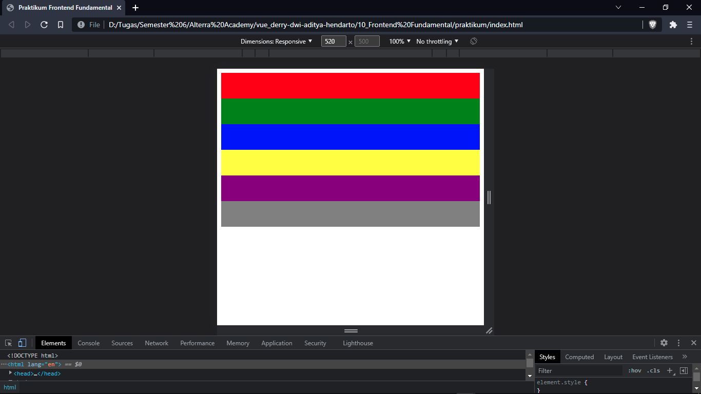
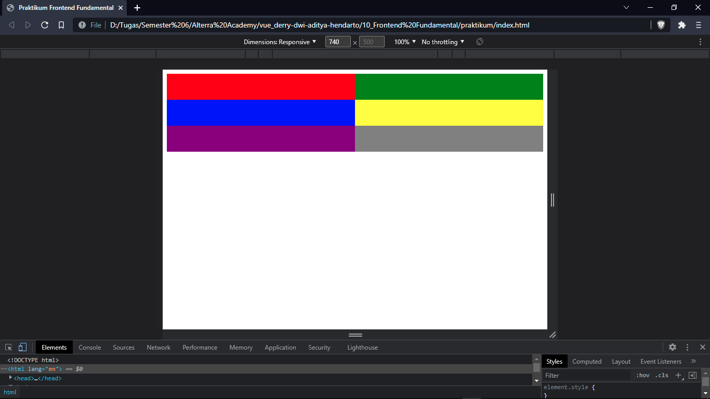
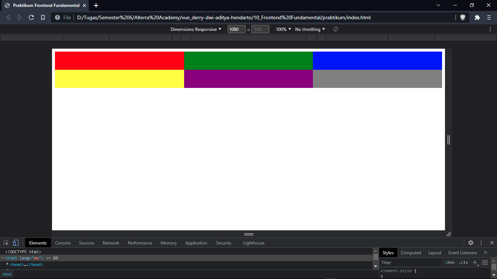
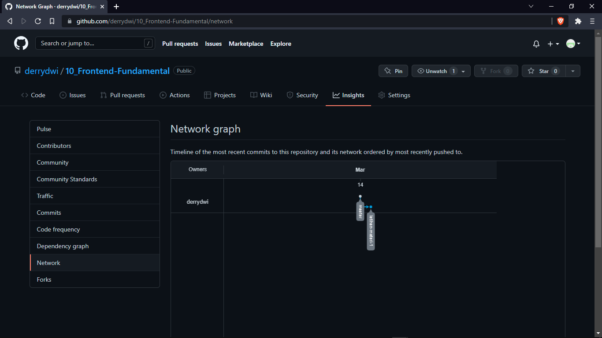

# 10 Frontend Fundamental

## Resume

Secara garis besar berikut adalah sub topik yang saya pelajari dari materi ini:

1. HTML
   - Definisi
   - Cara kerja
   - Tag HTML
   - Tag yang sering digunakan
2. CSS
   - Definisi
   - Cara kerja
   - Macam penggunaan
   - Media query
3. Javascript
   - Definisi
   - Cara kerja
   - Pengetahuan dasar
   - Aturan nama
4. Node.js
   - Definisi
   - Cara kerja
   - Cara instalasi
5. NPM
   - Definisi
   - Cara kerja
   - Struktur project NPM
   - Menambahkan dan install dependency
6. Git
   - Definisi
   - Cara kerja
   - Membuat repository
   - Mengunggah repo ke GitHub

### HTML

Hypertext Markup Language (HTML) merupakan suatu bahasa markup standar yang digunakan untuk membuat dan menyusun halaman dan aplikasi web. Analogi dari HTML, CSS, dan JS adalah HTML sebagai kerangka atau tulang, CSS sebagai pakaian atau kulit dan Javascript sebagai otak.

Dalam cara kerjanya HTML akan dirender dengan menggunakan web browser apapun.

Sebuah file HTML tersusun atas serangkaian tags atau elements. Dimana pertama terdapat tag pembuka `<tag>` dan penutup `</tag>`, kedua terdapat syntax penutup sendiri seperti `<input />`, dan komentar seperti `<!-- comment -->`.

Tag HTML memiliki dua tipe utama yakni block level `<div></div>` dan inline level `<span></span>`.

Tiga tag block-level yang harus dimiliki pada setiap file HTML adalah:

1. `<html>`
2. `<head>`
3. `<body>`

Adapun tag yang sering dipakai yakni sebagai berikut:

1. `<div></div>`
2. `<span></span>`
3. `<h1></h1>` `<h2></h2>` `<h3></h3>`
4. `<p></p>`
5. `<input />`
6. `<button></button>`
7. `<br />`
8. `<ul></ul>` `<ol></ol>`
9. `<form></form>`

### CSS

Cascading Style Sheets (CSS) ditujukan untuk mendesain halaman atau tampilan website. CSS menangani tampilan dan 'rasa' dari suatu halaman web.

Dalam cara kerjanya CSS membuat style di dalam halaman web yang dapat berinteraksi dengan elemen HTML. Style tersebut dapat dituliskan didalam suatu blok deklarasi yang terdiri dari property dan value yang didefinisikan di dalam selektornya.

Penggunaan CSS terdapat 3 jenis yakni Inline, Internal, dan External.

Media Queries adalah modul CSS yang dapat menangani pembuatan halaman web yang responsif mengikuti ukuran layar perangkat.

### Javascript

Javascript (JS) adalah suatu script yang mampu 'membuat halaman web menjadi hidup' dengan adanya interaksi antara pengguna dengan aplikasi web.

Pada dasarnya JS bisa ditulis langsung di dalam file HTML dan akan berjalan otomatis ketika web tersebut diakses. Namun kini JS juga mampu dijalankan di luar browser, yakni di suatu server atau di perangkat apapun yang memiliki runtime environtment JS seperti Node.js.

JS dapat disisipkan pada file HTML baik itu pada head atau body dengan diapit oleh tag `<script></script>`.

Hal-hal basic pada JS diantaranya adalah sebagai berikut:

- Variabel, merupakan tempat untuk menampung suatu nilai.
- Operasi matematika, seperti penambahan, pengurangan, perkalian, pembagian, dll dapat dilakukan dengan menggunakan JavaScript Operators.
- Fungsi, merupakan tempat untuk menampung logic atau algoritma yang digunakan berkali-kali.
- Kelas, merupakan suatu fungsi khusus yang digunakan sebagai template untuk membuat suatu object.
- Kondisi, merupakan sebuah logika pemisah antara nilai boolean true dan false.
- Pengulangan, berupa for, while, dan do while untuk melakukan pengulangan dengan syarat yang telah ditentukan. Adapun method-method dalam javascript seperti forEach, map, dan filter yang dapat mempersingkat suatu pengulangan.

Aturan penulisan variabel dalam JS idealnya menggunakan camelCase, sedangkan untuk variabel yang bersifat konstanta global menggunakan UPPERCASE dengan underscore. Selain itu selalu gunakan camelCase dan intonasi pertanyaan untuk variabel boolean. Pada fungsi gunakan camelCase dengan nama fungsi berawalan kata kerja. Untuk class dan component menggunakan PascalCase dan kata benda.

### Node.js

Node.js merupakan suatu runtime environtment untuk javascript. Dengan ini developer dapat menjalankan JS dimanapun atau dalam kata lain tidak terbatas pada lingkungan browser.

Cara kerja Node.js adalah melakukan eksekusi atau menjalankan file yang memiliki ekstensi js dengan mengetikkan command `node namaFile.js`.

File installer Node.js terdapat pada website nodejs.org, dan tersedia diberbagai OS seperti Windows, MacOS, dan Linux.

### NPM

Node Package Manager (NPM) adalah suatu tools command line based yang dapat melakukan install dan uninstall package, mengelola dependency yang dibutuhkan untuk menjalankan suatu project web. NPM akan secara otomatis terinstall ketika dilakukan instalasi Node.js.

NPM memiliki tugas untuk mengatur package pada project yang berjalan dengan Node.js. Dimana package-package ini memuat semua file yang dibutuhkan sebagai module.

Command `npm init` digunakan untuk membuat project baru, yang nantinya akan dibentuk pula file bernama package.json.

Struktur project NPM terdiri dari beberapa key, diantaranya adalah:

- name, merupakan nama project.
- scripts, adalah daftar command yang dapat di run di dalam project.
- dependencies, yaitu list library yang dipakai ketika masuk ke fase production.
- devDependencies, yaitu list library yang dipakai ketika berada di fase develop.

Command `npm install <nama module>` digunakan untuk menambahkan module ke dependencies. Sedangkan `npm install <nama module> -D` berguna untuk menambahkan module ke devDependencies. Setelah dijalankan command tersebut maka akan secara otomatis tersimpan library-library yang dibutuhkan pada folder node_modules, sekaligus terbentuk juga file bernama package-lock.json yang menampung informasi isi dan versi node_modules.

Adapun command `npm install` atau `npm i` yang berfungsi untuk mengunduh atau memperbarui node_modules sesuai dengan list dependensi yang ada di package.json.

### Git

Git merupakan suatu tools Version Control System. Dimana git mampu mencatat setiap perubahan pada file project yang dikerjakan dalam suatu tim maupun personal.

Cara kerja Git yakni memantau seluruh perubahan yang terjadi pada file project lalu menyimpannya ke suatu database. Git memiliki 3 area kerja yakni working directory, staging area, dan repository.

Adapun terminologi dalam Git diantaranya adalah:

- Modified, merupakan file yang telah diubah dan dicatat oleh git sehingga dapat dibandingkan dengan versi commit sebelumnya.
- Staged, adalah file yang telah diubah dan telah di add. Sehingga siap untuk dilakukan commit.
- Commit, yaitu tahap dimana file yang ada pada staging area disimpan dalam suatu snapshot ke dalam direktori git.
- Branch, merupakan cerminan direktori pada git.

Langkah-langkah untuk membuat repo yakni:

1. Install git
2. Pastikan git sudah terinstall dengan baik. Dengan mengetikkan perintah `git --version`
3. Buka terminal di direktori project
4. Run command `git init`

Adapun langkah-langkah untuk mengunggah repo ke GitHub yakni:

1. Buat akun github
2. Buat repo baru pada github
3. Salin link https repo yang telah dibuat
4. Run command berikut:
   ```shell
   git remote add origin <link-https-git>
   git add .
   git commit -m "<pesan-commit>"
   git push origin master <nama-branch>
   ```

## Task

### 1. Buatlah kode CSS yang akan membaut tampilan seperti pada soal.

Berikut kode hasil dari praktikum ini:

- [index.html](./praktikum/index.html)
- [style.css](./praktikum/assets/css/style.css)

Output:

- Lebar kurang dari 600px
  
- Lebar lebih dari atau sama dengan 600px dan kurang dari 960px
  
- Lebar lebih dari atau sama dengan 960px
  

### 2. Buat repository dan branch baru bernama "latihan-materi-1" berisi latihan yang sebelumnya.

Link Repository: https://github.com/derrydwi/10_Frontend-Fundamental

Output:

