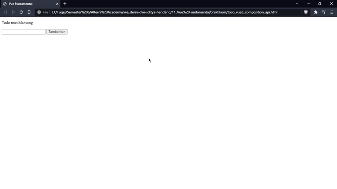

# 11 Vue Fundamental

## Resume

Secara garis besar berikut adalah sub topik yang saya pelajari dari materi ini:

1. Pengenalan Vue
   - Definisi Vue
   - Alasan Penggunaan Vue
   - Cara Kerja Vue
2. Vue Setup dan Resources
   - Tools yang Dibutuhkan
3. Dasar-dasar Vue
   - Vue Instance
   - Vue Data Binding
   - Vue Reactivity
4. Vue Directive
   - Definisi Vue Directive
   - Macam Vue Directive
   - Directive Shorthand
5. Events dan Method
   - Memantau Events
   - Menggunakan Methods
6. Computer Properties dan Watchers
   - Computed Properties
   - Watchers
7. Component
   - Definisi Component
   - Contoh Penggunaan

### Pengenalan Vue

Vue adalah suatu framework javascript yang dapat digunakan untuk mendevelop tampilan website yang interaktif dan dinamis.

Alasan penggunaan vue diantaranya adalah:

- Implementasi yang mudah
- Mudah dipelajari dan menyenangkan
- Dokumentasi lengkap dan tersusun rapi
- Ramping dan cepat

Terdapat dua cara kerja vue yakni:

- Vue CDN

  Digunakan langsung di file HTML dengan menambahkan script berikut.

  - Vue 2:

    ```html
    <script src="https://unpkg.com/vue@2"></script>
    ```

  - Vue 3:
    ```html
    <script src="https://unpkg.com/vue"></script>
    ```

- Vue CLI

  Aplikasi web dibuat menggunakan perkakas standar dari ekosistem Vue untuk memudahkan setiap proses development.

### Vue Setup dan Resources

Untuk mulai menggunakan vue tools yang diperlukan yaitu Text Editor dan Browser, lalu menambahkan dependensi dan inisialisasi vue.

### Dasar-dasar Vue

Pada setiap aplikasi vue akan diinisialisasikan sebuah instance vue.

Dalam proses data binding, vue menggunakan sintaks template berbasis HTML yang dapat digunakan untuk mengikat DOM yang dirender ke data instance vue yang mendasarinya. Adapun 3 jenis data binding pada vue yakni:

- Di dalam konten

  Teknik ini mengapit variabel dengan dua buah kurung kurawal.

  ```html
  <span>Message: {{ message }}</span>
  ```

- Di atribut elemen

  Menambahkan variabel ke dalam atribut elemen dapat menggunakan v-bind.

  ```html
  <div v-bind:id="dynamicId"></div>
  ```

- Elemen HTML

  Menambahkan HTML elemen ke dalam DOM dapat menggunakan atribut v-html.

  ```html
  <p>Menggunakan v-html directive: <span v-html="rawHtml"></span></p>
  ```

Vue instance memiliki properti data, yang valuenya dapat diubah-ubah saat ditampilkan tanpa harus dilakukan reload, yang disebut Vue Reactivity.

### Vue Directive

Vue directive merupakan suatu atribut dengan awalan v- yang berfungsi untuk menjalankan perintah atau ekpresi js didalam atribut.

Terdapat 5 kategori vue directive yang umum digunakan yaitu:

- v-bind

  Digunakan untuk melakukan one way data binding.

- v-model

  Digunakan untuk melakukan two way data binding.

- v-if, v-else, dan v-else-if

  Digunakan untuk melakukan rendering ke dalam elemen secara kondisional.

- v-on

  Digunakan untuk memanggil suatu fungsi saat event tertentu.

- v-for

  Digunakan untuk nelakukan pengulangan.

Terdapat shorthand pada vue directive yang memungkinkan untuk menuliskan `v-bind` menjadi `:` dan `v-on` menjadi `@`.

### Events dan Method

Untuk memantau events dapat digunakan vue directive v-on untuk mendengarkan peristiwa DOM dan menjalankan perintah JS saat event terjadi.

Methods merupakan fungsi yang dapat diakses secara langsung pada vue instance atau menggunakannya dalam ekspresi direktif. Semua method akan memiliki keyword "this" yang secara otomatis merujuk ke vue instance.

### Computed Properties dan Watchers

Computed properties biasanya digunakan untuk menjaga template supaya tetap sederhana dan deklaratif, sehingga program akan lebih ringan dan mudah dipelihara.

Watchers merupakan salah satu fitur pada vue yang dapat memantau variabel dan melakukan aksi tertentu ketika nilainya berubah.

### Component

Component adalah vue instance yang bersifat reusable sesuai nama yang didefinisikan. Dengan begitu component dapat digunakan sebagai custom element di dalam instance root vue.

## Task

### 1. Buatlah sebuah todo list, dengan ketentuan:

- Memiliki sebuah input dan tombol
- Menunjukkan list todo yang telah ditambahkan dan reset input setelah tombol diklik
- Jika list yang sudah dimasukkan lebih dari atau sama dengan 4 maka tunjukkan kata 'Hebat!' di bawah input.

Berikut kode hasil dari praktikum ini:

- [Todo Vue 2 Options API](./praktikum/todo_vue2_options_api.html)
- [Todo Vue 3 Composition API](./praktikum/todo_vue3_composition_api.html)

Output:


