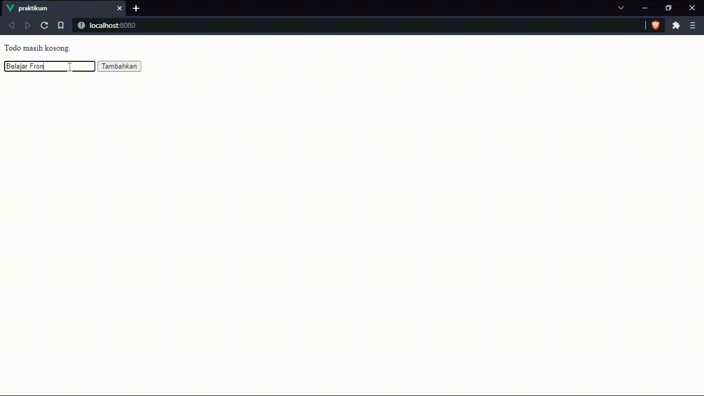

# 12 Vue CLI

## Resume

Secara garis besar berikut adalah sub topik yang saya pelajari dari materi ini:

1. Vue CLI
   - Definisi Vue CLI
   - Cara Kerja Vue CLI
   - Inisiasi Apps
   - Tools Penting
2. Vue SFC
   - Definisi SFC
   - Cara Kerja SFC
   - Struktur Isi Pada Komponen Vue
3. Vue Folder Structure

### Vue CLI

Vue CLI merupakan tools standar untuk mempermudah proses pengembangan aplikasi vue.

Webpack adalah suatu module bunder yang dapat digunakan untuk menggabungkan seluruh modul pada project berupa file JS, HTML, gambar, dsb menjadi satu file dengan tipe yang sama.

Cara kerja Vue CLI terdiri dari:

- Pemasangan Vue CLI

  Vue CLI dapat diinstal dengan mengetikkan perintah:

  ```shell
  npm install -g @vue/cli
  ```

  Lalu untuk memastikannya sudah terinstall dapat diketahui dengan mengetikkan perintah:

  ```shell
  vue --version
  ```

- Inisiasi Aplikasi

  Menyimpan project vue di dalam folder nama aplikasi:

  ```shell
  vue create <nama aplikasi>
  ```

  atau menyimpan project di direktori sekarang:

  ```shell
  vue create .
  ```

- Run Aplikasi

  Aplikasi dapat dirun pada mode development dengan mengetikkan perintah:

  ```shell
  npm run serve
  ```

  Adapun command yang berfungsi untuk mengunduh atau memperbarui node_modules sesuai dengan list dependensi yang ada di package.json, yaitu:

  ```shell
  npm install
  ```

  atau

  ```shell
  npm i
  ```

Tools penting yang mendukung proses development aplikasi vue diantaranya adalah:

- Vetur (Highlighter)
- ESLint (Linter)
- Prettier (Code Formatter)
- GitLens (Git Inspector)

### Vue SFC

SFC memungkinkan developer untuk membangun seluruh komponen meliputi struktur, gaya, dan fungsi dalam satu file. Selain itu, sebaian besar editor kode menyediakan syntax highlighting dan linting. Vue SFC memiliki ekstensi .vue

Cara kerja SFC terdapat 3 tag utama yakni:

- `<template>`

  Berfungsi seperti halnya HTML body, memuat dan merender HTML tag pada umumnya.

- `<script>`

  Berfungsi untuk memuat syntax javascript dan juga dapat menerima atribut lang yang biasanya ditujukkan untuk penggunaan Typescript.

- `<style>`

  Berfungsi untuk memuat syntax CSSS dan juga dapat menerima atribut lang yang biasanya ditujukkan untuk penggunaan CSS preprocessor seperti Stylus atau SCSS. Adapun atribut tambahan seperti scoped, yang menandakan bahwa CSS hanya akan diterapkan di komponen tersebut saja.

### Vue Folder Structure

- Assets

  Direktori untuk menyimpan semua file aset statis seperti font, icon, gambar, style, dsb.

- Components

  Direktori untuk menyimpan seluruh file SFC.

- Router

  Direktori untuk menyimpan seluruh file yang berkaitan dengan routing menggunakan vue-router.

- Store

  Direktori untuk menampung seluruh file yang berkaitan dengan penyimpanan state berbasis global menggunakan vuex.

- View

  Direktori untuk menyimpan seluruh file halaman. Perbedaanya dengan component yakni component akan berhubungan dengan view, dan view akan berhubungan dengan router.

- Test

  Direktori untuk menyimpan seluruh file unit testing komponen atau fungsi yang ada di dalam direktori src. Lokasi direktori ini berada di luar direktori src, karena pada dasarnya tidak berhubungan langsung dengan file yang dibutuhkan pada proses development.

## Task

### 1. Buatlah sebuah todo list menggunakan SFC, dengan ketentuan:

- Memiliki sebuah input dan tombol
- Menunjukkan list todo yang telah ditambahkan dan reset input setelah tombol diklik
- Jika list yang sudah dimasukkan lebih dari atau sama dengan 4 maka tunjukkan kata 'Hebat!' di bawah input.
- Jangan tambahkan todo jika menekan tombol tambahkan namun input kosong.

Berikut kode hasil dari praktikum ini:

- App
  - [App.vue](./praktikum/src/App.vue)
- Components
  - [TodoListItem.vue](./praktikum/src/components/TodoListItem.vue)
  - [TodoListInput.vue](./praktikum/src/components/TodoListInput.vue)
  - [TodoListMessage.vue](./praktikum/src/components/TodoListMessage.vue)

Output:


