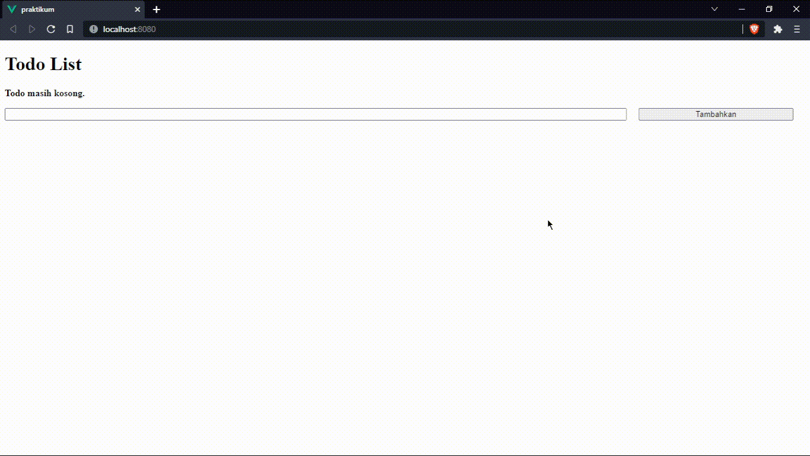

# 13 Komponen Vue

## Resume

Secara garis besar berikut adalah sub topik yang saya pelajari dari materi ini:

1. Module Export & Import
   - Definisi Module
   - Cara Export
   - Cara Import
2. Reusable Component
   - Definisi Reusable Component
   - Cara Kerja Reusable Component
   - Komunikasi Child dan Parent Component
3. Paradigma Fungsi Pembantu
   - Definisi Paradigma Fungsi Pembantu
   - Cara Kerja Paradigma Fungsi Pembantu
   - Tips
4. Instance Lifecycle Hooks
   - Definisi Lifecycle
   - Cara Kerja Lifecycle di Vue
   - Tiga Lifecycle Utama

## Task

### Module Export & Import

Modul merupakan suatu file yang bisa berupa class atau sekumpulan fungsi yang ditujukan untuk mengerjakan tugas tertentu. Modul bisa memuat satu sama lain dan menggunakan pengarah khusus export dan import untuk fungsi pertukaran, memanggil fungsi dari satu modul ke modul lainnya.

Perbedaan antara import yang digunakan oleh Module (ESM) dan Regular Script(CJS) yakni CJS mengimpor semua isi yang diekspor sedangkan ESM mengimprot yang dibutuhkan saja.

Export bertugas menyediakan fungsi, objek, atau nilai primitif dari modul sehingga dapat digunakan oleh modul lain dengan pernyataan import. Terdapat 2 tipe export yaitu:

- Named Exports

  Export nol atau lebih per modul

- Default Exports

  Export satu per modul

Import bertugas mengambil variabel, obyek atau fungsi yang disediakan oleh modul lain. Terdapat 4 tipe import yaitu:

- Import Defaults

  ```javascript
  import target
  ```

- Import Multiple Exports

  ```javascript
  import { target }
  ```

- Import rename Multiple Exports

  ```javascript
  import { target as t }
  ```

- Import Default + Multiple

  ```javascript
  import targetDefault, { target as t }
  ```

### Reusable Component

Reusable component adalah sebuah SFC Vue yang ditujukan untuk dapat digunakan lebih dari satu kali di tempat yang berbeda. Tujuannya supaya:

- Lebih rapi
- Lebih mudah dirawat
- Lebih berkualitas

Pada umumnya komponen dijadikan satu dengan komponen lain dan dipisah dengan komponen yang bertugas sebagai halaman. Dengan ketentuan:

- Halaman dapat menggunakan komponen namun komponen tidak dapat menggunakan halaman
- Komponen dapat menggunakan komponen lain.

Untuk mengekspos data dari induk ke anak dapat dilakukan dengan:

```html
<HelloWorld msg="Welcome to Your Vue.js App" @click="showAlert" />
```

Berdasarkan contoh diatas, terdapat msg yang merupakan props (berupa variabel) serta @click yang merupakan emits (berupa fungsi atau event).

### Paradigma Fungsi Pembantu

Paradigma Fungsi Pembantu adalah sebuah fungsi perkakas atau pembantu yang dapat digunakan lebih dari satu kali di tempat yang berbeda. Tujuannya supaya:

- Lebih efektif
- Lebih efisien
- Menghindari huru-hara

Pada umumnya fungsi pembantu dijadikan satu pada direktori yang sejajar dengan komponen atau halaman.

Fungsi pembantu bisa diberi nama yang berbeda-beda namun harus mudah dimengerti, jamak dan self-descripting seperti:

- Utilities
- Utils
- Helpers
- Tools

Beberapa contoh fungsi pembantu yang sering dipakai;

- Operator (penambahan, rata-rata, median, min-max, hitung umur dll.)
- Formatter (tanggal, waktu, mata uang dll.)
- Validator (email, nomor telfon, nomor kartu kredit dll.)
- Generator (angka random, text random, warna, format text dll.)

### Instance Lifecycle Hooks

Setiap Vue Instance melewati beberapa serangkaian tahapan pada saat
dibuat, tahapan ini disebut sebagai Lifecycle atau siklus hidup.


Siklus hidup sebuah Vue instance berawal ketika inisiasi dan berakhir ketika penghancuran.
Setiap siklus memiliki hook-nya masing-masing yang berbentuk fungsi. Beberapa diantaranya adalah sebagai berikut:

- beforeCreate
- created
- beforeMount
- mounted
- beforeUpdate
- updated
- activated
- deactivated
- beforeDestroy
- destroyed
- errorCaptured

Namun yang umum digunakan yakni 3 lifecycle utama sebagai berikut:

- Created

  Berlangsung setelah instance terbentuk dan sebelum DOM dirender.
  Contoh penggunaannya untuk menambahkan SEO Meta, dan memasang event listener scroll

- Mounted

  Berlangsung setelah DOM dirender.
  Contoh penggunaannya untuk handling loader

- Destroyed

  Berlangsung sebelum instance dihancurkan
  Contoh penggunaannya untuk mencopot event listener scroll

### 1. Buatlah sebuah todo list menggunakan SFC, dengan ketentuan:

- Input todo yang lebarnya memenuhi layar
- Memiliki tombol hapus dan edit dengan fungsionalitasnya
- Ketika tombol edit ditekan simpan perubahan setelah ditekan kembali
- Ketika tombol hapus ditekan maka list dibawahnya naik menggantikan
- Hint gunakan array map dan array filter

Berikut kode hasil dari praktikum ini:

- App
  - [App.vue](./praktikum/src/App.vue)
- Components
  - [BaseHeading.vue](./praktikum/src/components/BaseHeading.vue)
  - [BaseMessage.vue](./praktikum/src/components/BaseMessage.vue)
  - [TodoListItem.vue](./praktikum/src/components/TodoListItem.vue)
  - [TodoListInput.vue](./praktikum/src/components/TodoListInput.vue)

Output:


