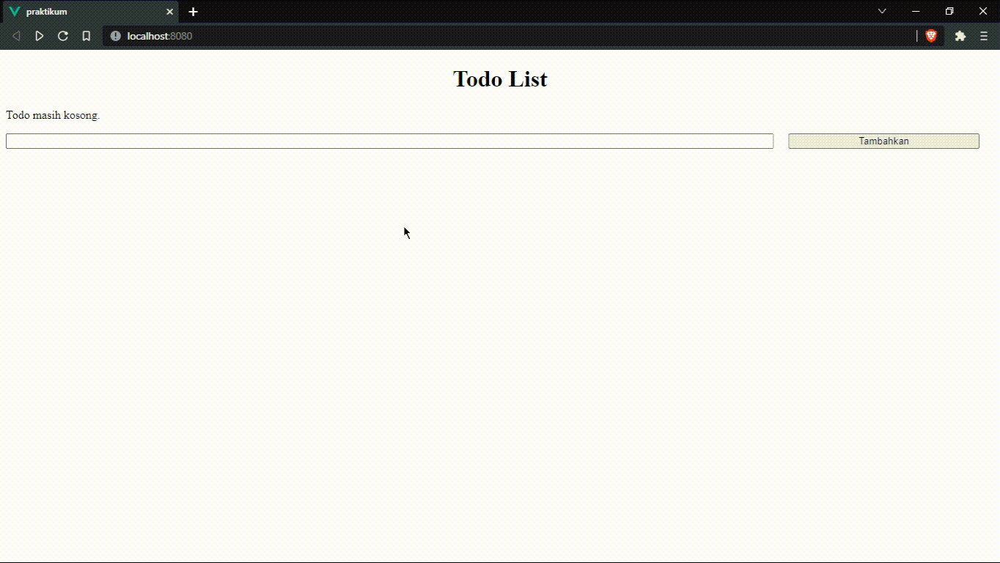

# 14 Vue Helpers

## Resume

Secara garis besar berikut adalah sub topik yang saya pelajari dari materi ini:

1. Navigasi Pada Vue
   - Definisi Navigasi
   - Cara Vue Melakukan Navigasi
   - Navigasi Beranak
   - Navigasi Dinamis
2. Layout Template Vue
   - Definisi Layout Template
   - Cara Kerja Layout Template
   - Membuat & Menggunakan Layout
3. Penyimpanan Global
   - Definisi Penyimpanan Global
   - Penyimpanan Global Dengan Vuex
   - Cara Kerja Vuex
   - Vuex Muatations & Actions
4. Penyimpanan Global Permanen
   - Definisi Penyimpanan Global Permanen
   - Penyimpanan Global Permanen dengan vuex-persistedstate
   - Menggunakan Penyimpanan Permanen

### Navigasi Pada Vue

Navigasi adalah aktivitas berpindah dari satu halaman ke halaman lainnya. Pada dasarnya, Vue adalah Single Page Application (SPA), yang berarti hanya ada satu entri halaman HTML, tetapi konten halaman HTML dirender ulang (dengan bantuan JS), sehingga seolah-olah berganti halaman.

Untuk dapat berpindah ke halaman yang diinginkan, hal pertama yang perlu Anda pastikan adalah halaman tersebut sudah tersedia, lalu melakukan konfigurasi file index.js pada direktori router.

Jenis-jenis redireksi:

```javascript
this.$router.push('/user');
this.$router.replace('/user');

this.$router.go(-1); // back
this.$router.go(1); // forward
```

Params dan Query:

```javascript
this.$router.push('/user');
// /user

const userId = 123;
this.$router.push({ name: 'user', params: { userId: userId } });
this.$router.push({ path: `/user/${userId}` });
// /user/123

this.$router.push({ path: 'register', query: { plan: 'private' } });
// /register?plan=private
```

Navigasi beranak adalah sub-path dari path yang ada. Contohnya adalah sebagai berikut:

```
/user/setting/privacy
```

Keterangan:

- user

  induk dari setting

- setting

  anak dari user dan induk dari privacy

- privacy

  anak dari setting

Navigasi dinamis adalah dimana path tersebut memiliki nilai sembarang dan kita tidak perlu mendefinisikan nilainya satu-persatu. Contohnya adalah sebagai berikut:

```
/user/123
```

Keterangan:

- user

  Navigasi statis. Dimana path didefinisikan manual sebagai /user

- 123

  Navigasi dinamis. Path tidak didefinisikan sesuai nilainya, melainkan sesuai key parameter, seperti /user/:id

Untuk mengambil nilai dinamis pada path parameter dapat menggunakan:

```javascript
this.$route.params.id;
```

### Layout Template Vue

Layout adalah susunan tata letak, sedangkan layout template pada Vue adalah komponen yang dapat dipakai sebagai susunan tata letak dasar yang membungkus masing-masing halaman. Fungsi layout yakni untuk mengisolasi logika tampilan viewport agar kode di setiap halaman tetap bersih dan efisien.

- Layout

  Memuat susunan tata letak yang sama untuk setiap halaman, seperti halnya navbar atau footer.

- Halaman

  Memuat komponen yang berubah ubah sesuai konten halaman, namun sudah tidak perlu lagi menyertakan navbar di setiap komponen view halaman.

Pada dasarnya layout hanyalah komponen biasa, yang membedakan adalah layout dapat meneruskan konten dari anak komponennya. Umumnya layout memiliki direktori terpisah sejajar dengan direktori router atau sejajar dengan direktori view.

### Penyimpanan Global

Penyimpanan Global adalah sebuah metode untuk menyimpan variabel yang dapat diakses dengan mudah di seluruh bagian aplikasi.

- State Komponen

  Hanya tersimpan dan valid pada satu komponen saja

- Props

  Hanya tersimpan dan valid di induk atau anak komponen saja

- Store

  Tersimpan dan valid di bagian manapun dari aplikasi

Vuex adalah pola manajemen penyimpanan atau store yang berbentuk
pustaka untuk aplikasi Vue.js. Dalam kata lain Vuex Adalah penyimpanan terpusat untuk semua komponen dalam aplikasi, dengan aturan yang memastikan bahwa variabel yang tersimpan hanya dapat dimutasi dengan cara yang terstruktur dan terprediksi.

Untuk membuat store dengan Vuex dapat menggunakan syntax sebagai
berikut, kemudian sisipkan store ke dalam inisiasi Vue yang ada di main.js.

- @/store/index.js

  ```javascript
  import Vue from 'vue';
  import Vuex from 'vuex';

  Vue.use(Vuex);
  export default new Vuex.Store({
    state: {
      angka: 14,
    },
  });
  ```

- @/main.js

  ```javascript
  import Vue from "vue" ;
  import App from "./App.vue";
  import router from "./router";
  import store from "./store";

  new Vue
    router,
    store,
    render: (h) => h(App),
  }).$mount("app");
  ```

Untuk memanggil state variabel yang telah tersimpan di Vuex store, dapat menggunakan:

```javascript
this.$store.state.angka;
```

Direktori vuex store umumnya Vuex store memiliki direktori sendiri bernama store yang sejajar dengan direktori main.js. Selain index.js biasanya di dalam direktori store juga tersimpan modul-modul store untuk pengelompokan state supaya lebih rapi dan terstruktur.

Vuex Mutations digunakan untuk memodifikasi nilai dari state yang tersimpan di dalam store menggunakan syntax mutation berikut:

```javascript
import Vue from 'vue';
import Vuex from 'vuex';

Vue.use(Vuex);

export default new Vuex.Store({
  state: {
    angka: 14,
  },
  mutations: {
    setAngka(state, param) {
      state.angka = param;
    },
  },
});
```

Kemudian dari komponen dapat memanggil fungsi mutations yang telah dibuat dengan syntax berikut:

```javascript
this.$store.commit('setAngka', this.newInputValue);
```

Keterangan:

- commit

  key untuk melakukan mutation

- setAngka

  nama mutation

- this.newInputValue

  payload atau mutation

Tetapi yang perlu dipahami bahwa best practice dari penggunaan mutation hanya bertujuan untuk mengubah nilai variabel yang ada di dalam store tanpa ada logika pengolahan muatan di dalam fungsi mutation tersebut. Sehingga dari komponen Vue disarankan untuk terhubung ke Actions, sedangkan Actions akan berhubungan langsung dengan Mutations.

Vuex Actions merupakan pintu masuk perintah yang menghubungkan komponen dengan store, Actions perlu memanggil fungsi di Mutations untuk memodifikasi nilai state yang ada di Store. Selain itu, Actions juga tempat untuk melakukan komunikasi dengan API.

Untuk memodifikasi nilai dari state yang tersimpan di dalam store menggunakan syntax action sebagai berikut:

```javascript
import Vue from 'vue';
import Vuex from 'vuex';

Vue.use(Vuex);

export default new Vuex.Store({
  state: {
    angka: 14,
    infoText: 'Angka Lebih besar dari sepuluh',
  },
  mutations: {
    setAngka(state, param) {
      state.angka = param;
    },
    setInfo(state, param) {
      state.infoText = param;
    },
  },
  actions: {
    changeAngkaValue(store, param) {
      store.commit('setAngka', param);
      if (param > 10) {
        store.commit('setInfo', 'Angka Lebih besar dari sepuluh');
      } else {
        store.commit('setInfo', 'Angka Lebih kecil dari sepuluh');
      }
    },
  },
});
```

Kemudian dari komponen dapat memanggil fungsi action yang telah dibuat dengan syntax berikut:

```javascript
this.$store.dispatch('changeAngkaValue', this.newInputValue);
```

Keterangan:

- dispatch

  key untuk melakukan action

- changeAngkaValue

  nama action

- this.newInputValue

  payload atau mutation

Salah satu praktik terbaik dalam penggunaan Vuex Store adalah dengan cara memisah atau mengisolasi state, mutations dan actions ke dalam modul-modul terpisah.

Sebagai contoh jika terdapat modul demo yang berisikan state, mutation, dan action, maka pada file index.js dapat diimport dan dituliskan menggunakan spread syntax seperti berikut:

```javascript
import Vue from 'vue';
import Vuex from 'vuex';
import demo from './demo';

Vue.use(Vuex);

export default new Vuex.Store({
  modules: {
    demo: {
      namespaced: true,
      ...demo,
    },
  },
});
```

Properti namespaced bernilai true yang tadi disisipkan berfungsi untuk menandakan bahwa pemanggilan action perlu menyertakan nama module + slash sebelum nama action sehingga seperti berikut:

```javascript
this.$store.dispatch('demo/changeAngkaValue", this.newInputValue);
```

Sebaliknya jika bernilai false maka tidak perlu menyertakan nama module + slash sebelum nama action sehingga seperti berikut:

```javascript
this.$store.dispatch('changeAngkaValue", this.newInputValue);
```

### Penyimpanan Global Permanen

Nilai yang ada di dalam Vuex store akan dihapus atau disetel ulang sesuai dengan nilai awal jika halaman dimuat ulang. Hal tersebut terjadi karena nilai state yang ada di store disimpan di dalam memory instance.

Penyimpanan global permanen adalah state yang bersifat permanen sehingga state tersebut tidak akan hilang meskipun halaman diload ulang.

Dependencies vuex-persistedstate dapat mempertahankan state yang ada di antara pemuatan ulang halaman, dengan menyimpannya di localstorage atau bahkan di dalam cookies.

Untuk menggunakan vuex-persistedstate dapat dilakukan npm i vuex-persistedstate terlebih dahulu, kemudian memodifikasi index.js menjadi seperti berikut:

```javascript
import Vue from 'vue';
import Vuex from 'vuex';
import createPersistedState from 'vuex-persistedstate';

import demo from './demo';

Vue.use(Vuex);

const persistedDataState = createPersistedState({
  paths: ['demo'],
});

export default new Vuex.Store({
  plugins: [persistedDataState],
  modules: {
    demo: {
      namespaced: true,
      ...demo,
    },
  },
});
```

## Task

### 1. Buatlah sebuah todo list menggunakan SFC, dengan ketentuan:

- Input todo yang lebarnya memenuhi layar
- Memiliki tombol hapus dan edit dengan fungsionalitasnya
- Ketika tombol edit ditekan simpan perubahan setelah ditekan kembali
- Ketika tombol hapus ditekan maka list dibawahnya naik menggantikan
- Hint gunakan array map dan array filter

Berikut kode hasil dari praktikum ini:

- App
  - [App.vue](./praktikum/src/App.vue)
- Views
  - [DetailView.vue](./praktikum/src/views/DetailView.vue)
  - [HomeView.vue](./praktikum/src/views/HomeView.vue)
- Components
  - [BaseButton.vue](./praktikum/src/components/BaseButton.vue)
  - [BaseHeading.vue](./praktikum/src/components/BaseHeading.vue)
  - [BaseMessage.vue](./praktikum/src/components/BaseMessage.vue)
  - [TodoListInput.vue](./praktikum/src/components/TodoListInput.vue)
  - [TodoListItem.vue](./praktikum/src/components/TodoListItem.vue)
- Router
  - [index.js](./praktikum/src/router/index.js)
- Store
  - [index.js](./praktikum/src/store/index.js)
  - [todo.js](./praktikum/src/store/todo.js)

Output:


