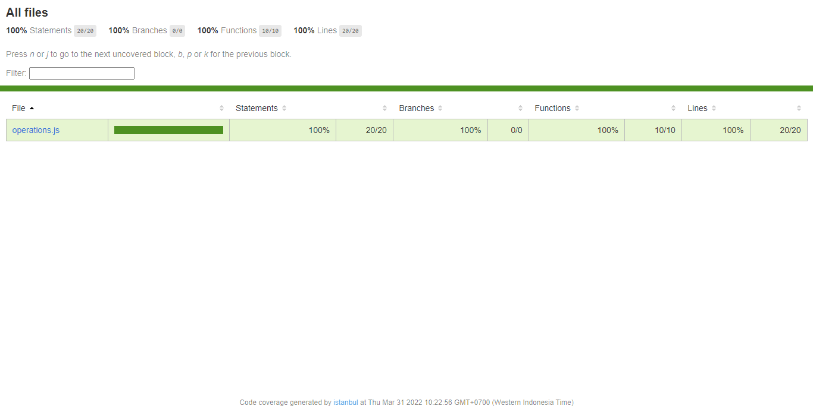
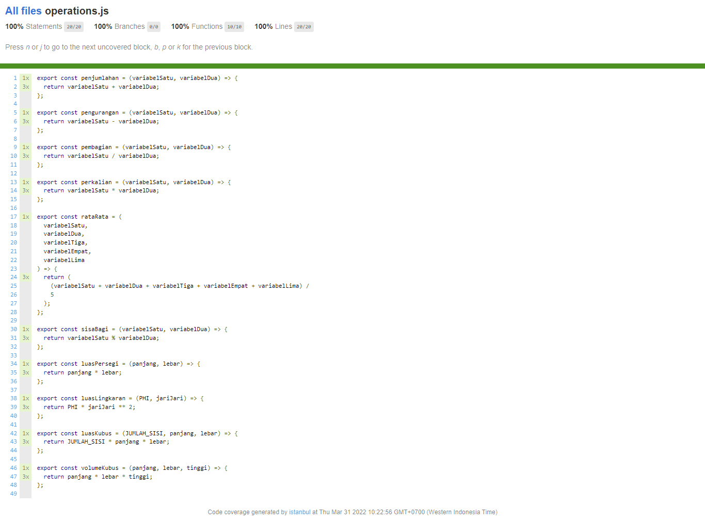

# 16 Vue Quality Control

## Resume

Secara garis besar berikut adalah sub topik yang saya pelajari dari materi ini:

1. Debugging
   - Definisi Debugging
   - Cara Kerja Debugging
   - Tools Debugging
   - Tips Debugging
2. Unit Testing
   - Definisi Unit Testing
   - Cara Kerja Unit Testing
   - Tools Unit Testing
   - Alasan Penggunaan Unit Testing
3. Jest
   - Definisi Jest
   - Cara Kerja Jest
   - Implementasi Jest
   - Coverage
4. Matriks Ukur Kinerja
   - Definisi Matriks Ukur Kinerja
   - Cara Kerja Matriks Ukur Kinerja
   - Lighthouse Audit
   - Mengukur Matriks dengan Lighthouse Audit
5. Mengoptimalkan Kinerja
   - Definisi Mengoptimalkan Kinerja
   - Core Web Vitals

### Debugging

Debugging adalah proses mengidentifikasi dan menghilangkan kesalahan dari perangkat lunak komputer.

Cara untuk melakukan debugging adalah dengan mengidentifikasi kesalahan dan mengidentifikasi solusi.

Tools untuk melakukan debuggin diantaranya adalah:

- Devtools
- Consoles
- Logs

Tips dalam mengidentifikasi kesalahan adalah:

- Tenang dan fokus
- Rasional dan kontekstual
- Perhatian yang detail untuk petunjuk sekecil apapun
- Tidak tergesa-gesa untuk bertanya

Sumber identifikasi solusi bisa datang dari:

- Diri sendiri (pengetahuan dan pengalaman)
- Rekan Kerja (peer, senior, atau leader)
- Google (dokumentasi, stackoverflow, isu repo, blog atau vlog tutorial)
- Komunitas (forum, telegram, discord, media sosial, dll.)

### Unit Testing

Proses verifikasi bahwa kode kita benar-benar berperilaku seperti yang diharapkan dan validasi bahwa kode kita tetap benar sepanjang masa aplikasi.

Unit Testing memberikan kita kesempatan untuk menguji potongan kode secara individual dan terisolasi dalam bentuk Test Assertion.

Test assertion ini adalah ekspresi boolean yang mengembalikan nilai true kecuali ada kesalahan atau perilaku yang tidak diharapkan di kode kita.

Unit Testing pada aplikasi Vue umumnya dilakukan oleh pustaka rangka kerja pendukung.

Tersedia 2 pilihan library yaitu Jest dan Mocha.

Alasan penggunaan unit testing diantaranya untuk:

- Meningkatkan rasa percaya diri
- Meningkatkan standar kode
- Mencegah kesalahan sebelum benar-benar terjadi
- Memberi batasan dan kriteria yang jelas jika melakukan refactor

### Jest

Jest adalah salah satu kerangka kerja untuk melakukan Unit Testing pada aplikasi yang berbasis Javascript.

### Matriks Ukur Kinerja

Matriks Ukur Kinerja adalah tolak ukur penting yang menunjukkan informasi seberapa baik kinerja aplikasi kita.

Dengan bantuan sebuah perkakas yang menjalankan serangkaian pemeriksaan sebelum menghasilkan laporan terperinci dan skor tentang seberapa baik kinerja halaman.

Lighthouse audit adalah perkakas yang membantu menentukan skor pada matriks ukur kinerja aplikasi web.

Jalankan aplikasi pada peramban Google Chrome, buka Devtools pada tab Lighthouse kemudian "Generate Report".

### Mengoptimalkan Kinerja

Mengoptimalkan Kinerja adalah proses untuk meningkatkan kinerja aplikasi web berdasarkan informasi skor matriks ukur.

Core Web Vitals adalah kumpulan metrik website yang ditentukan oleh Google. Kumpulan metrik ini ditetapkan sebagai bagian dari indikator ranking pencarian terbaru Google, yaitu page experience.

Indikator Core Web Vitals diantaranya adalah:

- Largest Contentful Paint (LCP)

  Berkaitan dengan kecepatan website

- First Input Delay (FID)

  Berkaitan dengan baik atau tidaknya respon elemen halaman website

- Cumulative Layouts Shift (CLS)

  Berkaitan dengan stabilitas layout halaman web

## Task

### 1. Buatlah sebuah file pembantu yang berisikan operasi aritmatika yang valid. Kemudian buatlah unit test yang meliputi 100% coverage dari file tersebut, dengan ketentuan:

- Operasi yang harus ada:

  - Penjumlahan (2 parameter)
  - Pengurangan (2 parameter)
  - Pembagian (2 parameter)
  - Perkalian (2 parameter)
  - Rata-rata (5 parameter)
  - Sisa bagi (2 parameter)
  - Luas Persegi (2 parameter)
  - Luas Lingkaran (2 parameter)
  - Luas Kubus (3 parameter)
  - Volume Kubus (3 parameter)

- Minimal 3 test case untuk masing-masing operasi.

Berikut kode hasil dari praktikum ini:

- [operations.js](./praktikum/src/utils/operations.js)
- [operations.spec.js](./praktikum/tests/unit/operations.spec.js)

Output:

- CLI Unit Test:
  

- Report Unit Test:
  

  
