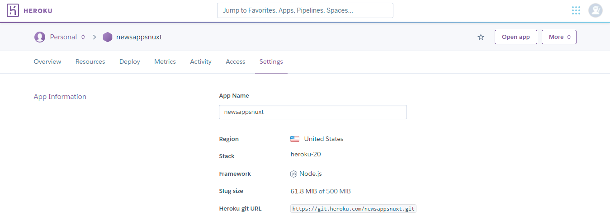

# 19 Vue With Nuxt

## Resume

Secara garis besar berikut adalah sub topik yang saya pelajari dari materi ini:

1. Pengenalan Nuxt
   - Definisi Nuxt
   - Cara Kerja Nuxt
   - Pemasangan Nuxt
   - Menggunakan Nuxt
2. Struktur Direktori Nuxt
   - Perbedaan Struktur Direktori Dengan Vue
   - Page
   - Layouts
   - Static
3. Nuxt SSG & SSR
   - Definisi Nuxt SSG & Cara Kerjanya
   - Definisi Nuxt SSR & Cara Kerjanya
   - Implementasi SSG
   - Implementasi SSR
4. SEO Meta
   - Definisi SEO & SEO Meta
   - Cara Kerja SEO Meta
   - Implementasi SEO Meta
   - SEO Tag Penting
5. PWA
   - Definisi PWA
   - Cara Kerja PWA
   - Implementasi PWA

## Task

### Pengenalan Nuxt

Kerangka kerja yang dibangun di atas Vue yang membuat pengembangan web menjadi sederhana dan ampuh.

Cara kerja Nuxt yakni dengan melakukan inisialisasi aplikasi dan menjalankan aplikasi.

Untuk membuat sebuah aplikasi Nuxt baru digunakan command:

```shell
npx create-nuxt-app <nama-proyek>
```

Untuk menjalankan aplikasi, terdapat beberapa perintah yang tertulis di script di dalam package.json.

### Struktur Direktori Nuxt

Perbedaan direktori Nuxt dengan Vue adalah sebagai berikut:

```
- src
- public
- views
- router
+ pages
+ static
+ layouts
```

Router di Nuxt secara otomatis membaca direktori ini sehingga file yang ada di direktori /pages langsung terhubung menjadi path halaman.

Setiap file di direktori /layouts akan membuat tata letak khusus yang dapat diakses dengan properti layout di komponen halaman.

Semua file yang disertakan akan secara otomatis diekspose oleh Nuxt dan dapat diakses melalui URL root proyek

### Nuxt SSG & SSR

Jenis yang pertama yakni Static Site Generation (SSG), metode pengembangan ini lebih cocok untuk situs web yang tidak memiliki halaman dinamis.

Ketika sebuah proyek dibangun untuk produksi, file HTML siap pakai akan dibuat di folder dist, kemudian disuguhkan oleh server dan dapat diakses per masing-masing file HTML.

Implementasi SSG

```javascript
// nuxt.config.js;
export default {
  target: 'static',
};
```

```shell
npm run generate
```

Hasil adalah berupa direktori /dist yang kemudian dapat dideploy ke Static Hosting.

Jenis yang kedua adalah Server Side Rendering (SSR), metode pengembangan ini adalah solusi terbaik untuk proyek di mana halaman dibuat secara real time, yaitu melalui panel admin, misalnya, halaman blog dan e-commerce.

Server yang dibangun ke dalam Nuxt akan berjalan dalam produksi, yang akan memastikan bahwa file HTML baru dihasilkan secara real time ketika data baru diterima, mis. melalui API.

Implementasi SSR

```javascript
// nuxt.config.js;
export default {
  target: 'server',
};
```

```shell
npm run build
```

Hasil adalah berupa direktori /.nuxt yang kemudian dapat dideploy ke NodeJS server.

### SEO Meta

Kepanjangan dari Search Engine Optimization, yaitu proses meningkatkan kualitas dan kuantitas lalu lintas situs web ke situs web atau halaman web dari mesin pencari.

Sedangkan SEO Meta tag adalah tag tak terlihat di dalam <head> yang memberikan data tentang halaman ke mesin pencari dan pengunjung situs web.

SEO Meta Tag dapat diterapkan dari Nuxt config untuk pengaturan global, yaitu konten head akan sama di setiap halaman aplikasi

SEO Meta Tag Penting

- Informasi dasar: title dan description
- Identitas unik dengan link canonical
- Informasi untuk media sosial, open graph: og:title, og:description, og:image,

SEO di dalam Body Tag

- Judul: h1
- Text alternatif untuk gambar: alt

SEO Lainnya

- Peta indexing: sitemap
- Pengarah crawler: robots.txt

### PWA

Kepanjangan dari Progressive Web Apps, dibuat dan disempurnakan dengan API modern untuk menghadirkan peningkatan kemampuan, keandalan, dan kemudahan pemasangan sekaligus menjangkau siapa saja, di mana saja, di perangkat apa pun dengan basis kode tunggal.

Cara Kerja atau Syarat yang harus dipenuhi untuk membuat aplikasi PWA:

- Web App Manifest
- Icon
- Service Workers
- Disajikan melalui protokol HTTPS

```json
// package.json
{
  "dependencies": {
    "@nuxtjs/axios": "^5.13.6",
    "@nuxtjs/pwa": "^3.3.5",
    "core-js": "^3.19.3",
    "nuxt": "^2.15.8",
    "vuetify": "^2.6.1"
  }
}
```

```javascript
// nuxt.config.js;
export default {
  pwa: {
    manifest: {
      name: 'Frontend Vue',
      short_name: 'FE Vue',
      lang: 'id',
      useWebmanifestExtension: false,
      start_url: '/',
      theme_color: '#5accef',
    },
  },
};
```

### 1. Deploy aplikasi berita pada latihan materi Vue UI Framework menggunakan Netlify atau Heroku

Ketentuan:

- Pastikan nama halaman tidak random dan halaman tidak rusak ketika dimuat ulang

Berikut kode hasil dari praktikum ini:

- ~
  - [nuxt.config.js](./praktikum/nuxt.config.js)
- app
  - [router.scrollBehavior.js](./praktikum/app/router.scrollBehavior.js)
- components
  - [BaseError.vue](./praktikum/components/BaseError.vue)
  - [BaseHeading.vue](./praktikum/components/BaseHeading.vue)
  - [BaseLoading.vue](./praktikum/components/BaseLoading.vue)
  - [NewsCard.vue](./praktikum/components/NewsCard.vue)
  - [SideMenu.vue](./praktikum/components/SideMenu.vue)
  - [TheFooter.vue](./praktikum/components/TheFooter.vue)
  - [TheNavbar.vue](./praktikum/components/TheNavbar.vue)
- layouts
  - [default.vue](./praktikum/layouts/default.vue)
  - [error.vue](./praktikum/layouts/error.vue)
- pages
  - [\_slug.vue](./praktikum/pages/_slug.vue)
  - [index.vue](./praktikum/pages/index.vue)
- plugins
  - [persistedState.client.js](./praktikum/plugins/persistedState.client.js)
- store
  - [news.js](./praktikum/store/news.js)
- utils
  - [formatter.js](./praktikum/utils/formatter.js)

Berikut hasil deploy dari praktikum ini:



https://newsappsnuxt.herokuapp.com

Output:


