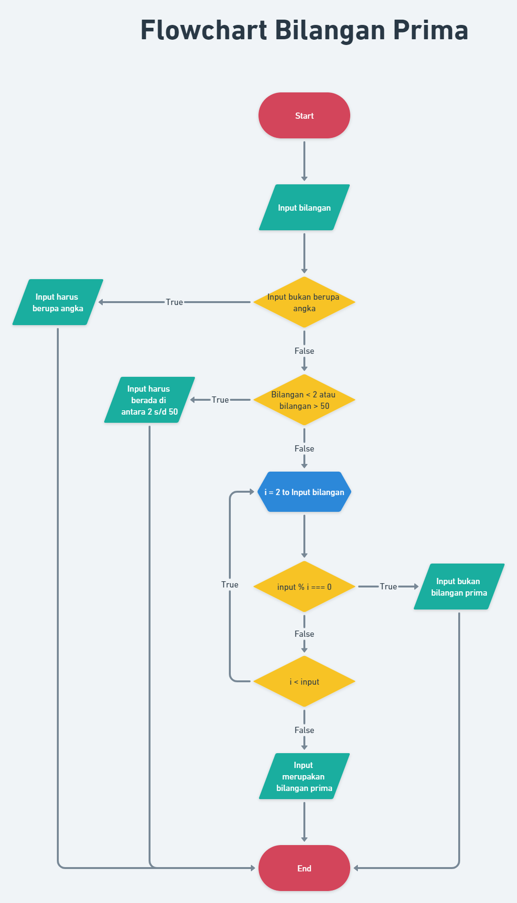
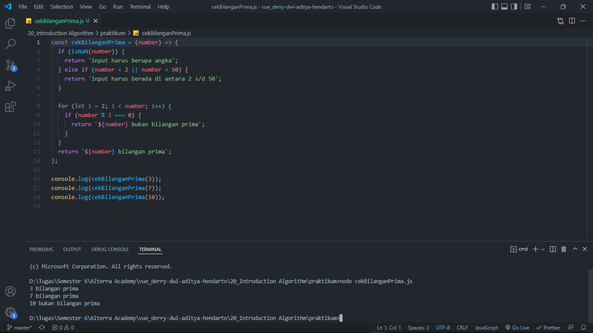

# 20 Introduction Algorithm

## Resume

Secara garis besar berikut adalah sub topik yang saya pelajari dari materi ini:

### Definisi Algoritma

Algoritma adalah prosedur komputasi yang didefinisikan dengan baik yang mengambil beberapa nilai sebagai input dan menghasilkan beberapa nilai sebagai output.

Contoh algoritma diantaranya adalah:

- Check prime number
- Sorting
- Searching

### Karakteristik Algoritma

- Memiliki batas (Awal dan akhir)
- Instruksi terdefinisi dengan baik
- Efektif & Efisien

### Algoritma Dasar

- Sequential
- Branching
- Looping

### Pseudocode

Pseudocode atau kode semu adalah deskripsi dari algoritma pemrograman yang dibuat dengan tujuan agar mudah dibaca dan dipahami oleh manusia.

### Flowchart

Flowchart adalah adalah suatu bagan dengan simbol tertentu yang menggambarkan urutan dan hubungan antar proses secara mendetail. Contoh jenisnya adalah sebagai berikut:

- Mulai / Selesai
- Proses
- Input / Output
- Perkondisian
- Looping

## Task

#### Soal:

Problem 1 - Bilangan Prima (max : 50)
Dalam matematika, bilangan prima adalah bilangan asli yang lebih besar dari angka 1, yang faktor pembaginya adalah 1 dan bilangan itu sendiri. 2 dan 3 adalah bilangan prima. 4 bukan bilangan prima karena 4 bisa dibagi 2. Kamu diminta untuk membuat fungsi untuk menentukan bahwa sebuah bilangan termasuk bilangan prima atau tidak.

Buatlah flowchart untuk menentukan bilangan prima menggunakan https://whimsical.com!

Sample Test Cases

- Input: 3

  Output: Bilangan Prima

- Input: 7

  Output: Bilangan Prima

- Input: 10

  Output: Bukan Bilangan Prima

#### Jawab:

- Flowchart:

  [Link Flowchart](https://whimsical.com/flowchart-bilangan-prima-DggzaZxxm8p4QtzXzgEg5h)

- Berikut kode hasil dari praktikum ini:

  [cekBilanganPrima.js](./praktikum/cekBilanganPrima.js)

- Output:

  
  
