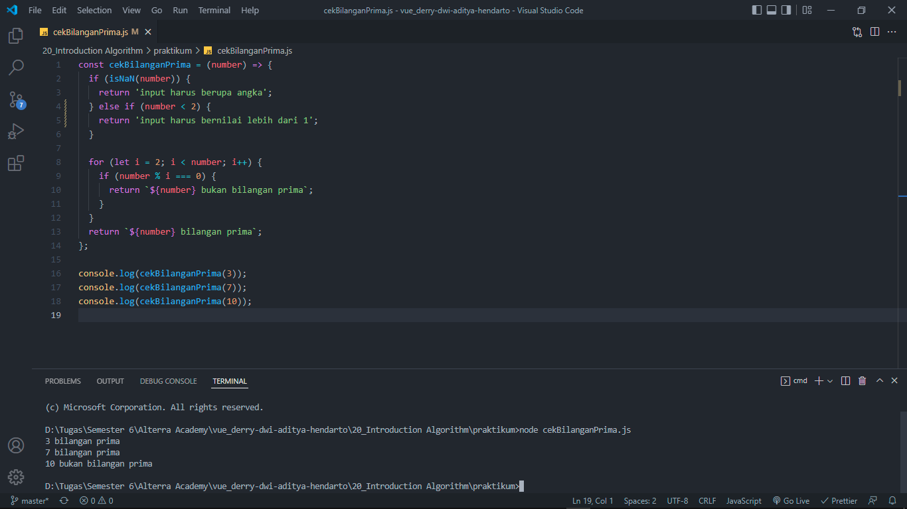

# 20 Introduction Algorithm

## Resume

Secara garis besar berikut adalah sub topik yang saya pelajari dari materi ini:

### Definisi Algoritma

Algoritma adalah prosedur komputasi yang didefinisikan dengan baik yang mengambil beberapa nilai sebagai input dan menghasilkan beberapa nilai sebagai output.

Contoh algoritma diantaranya adalah:

- Check prime number
- Sorting
- Searching

### Karakteristik Algoritma

- Memiliki batas (Awal dan akhir)
- Instruksi terdefinisi dengan baik
- Efektif & Efisien

### Algoritma Dasar

- Sequential
- Branching
- Looping

### Pseudocode

Pseudocode atau kode semu adalah deskripsi dari algoritma pemrograman yang dibuat dengan tujuan agar mudah dibaca dan dipahami oleh manusia.

### Flowchart

Flowchart adalah adalah suatu bagan dengan simbol tertentu yang menggambarkan urutan dan hubungan antar proses secara mendetail. Contoh jenisnya adalah sebagai berikut:

- Mulai / Selesai
- Proses
- Input / Output
- Perkondisian
- Looping

## Task

#### Soal 1:

Problem 1 - Bilangan Prima (max : 50)
Dalam matematika, bilangan prima adalah bilangan asli yang lebih besar dari angka 1, yang faktor pembaginya adalah 1 dan bilangan itu sendiri. 2 dan 3 adalah bilangan prima. 4 bukan bilangan prima karena 4 bisa dibagi 2. Kamu diminta untuk membuat fungsi untuk menentukan bahwa sebuah bilangan termasuk bilangan prima atau tidak.

Buatlah flowchart untuk menentukan bilangan prima menggunakan https://whimsical.com!

Sample Test Cases

- Input: 3

  Output: Bilangan Prima

- Input: 7

  Output: Bilangan Prima

- Input: 10

  Output: Bukan Bilangan Prima

#### Jawab 1:

- Berikut kode hasil dari praktikum ini:

  [cekBilanganPrima.js](./praktikum/cekBilanganPrima.js)

- Output:

  

#### Soal 2:

Problem 2 - Lampu dan Tombol! (max : 50)

Terdapat N tombol yang dinomori dari 1 hingga N dan sebuah lampu dalam keadaan mati. Apabila tombol ke-i ditekan, keadaan lampu akan berubah (dari mati menjadi menyala, atau sebaliknya) jika N habis dibagi oleh i. Apabila masing-masing tombol ditekan tepat sekali,
bagaimana keadaan lampu pada akhirnya?

Format Masukan

Sebuah baris berisi sebuah bilangan, yaitu N.
Sebuah baris berisi sebuah bilangan, yaitu N. Format Keluaran Sebuah baris berisi:

- "lampu mati", apabila keadaan akhir lampu adalah mati.
- "lampu menyala", apabila keadaan akhir lampu adalah menyala.

Buatlah flowchart untuk algoritma tersebut menggunakan https://whimsical.com!

- Contoh Masukan : 5

  Contoh Keluaran : lampu mati

- Contoh Masukan: 4

  Contoh Keluaran: lampu menyala

Penjelasan

Pada contoh pertama, tombol yang mempengaruhi keadaan lampu adalah tombol 1 dan tombol 5. Penekanan tombol 1 mengakibatkan lampu menjadi menyala, dan penekanan tombol 5 mengembalikannya ke keadaan mati.
Pada contoh kedua, tombol yang mempengaruhi keadaan lampu adalah tombol 1, tombol 2, dan tombol 4. Penekanan tombol 1 mengakibatkan lampu menjadi menyala, penekanan tombol 2 mengembalikannya ke keadaan mati, dan penekanan tombol 4 menjadikan lampu kembali menyala.

#### Jawab 2:

- Berikut kode hasil dari praktikum ini:

  [cekLampuDanTombol.js](./praktikum/cekLampuDanTombol.js)

- Output:

  

#### Output Flowchart

[Link Flowchart](https://whimsical.com/flowchart-bilangan-prima-DggzaZxxm8p4QtzXzgEg5h)

