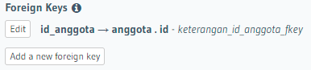
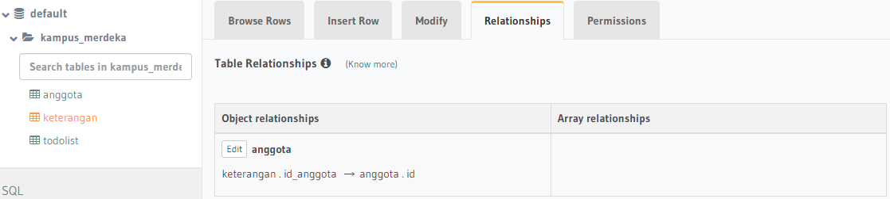

# 22 Relational Database

## Resume

Secara garis besar berikut adalah sub topik yang saya pelajari dari materi ini:

### Introduction Database

Terdapat 3 jenis relasi database yakni:

- One-to-one

  Contoh: Satu user twitter hanya memiliki satu foto profil

- One-to-many

  Contoh: Satu user twitter bisa memiliki banyak tweets

- Many-to-many

  Contoh: Satu user twitter bisa memiliki banyak follower user, 1 user bisa di follow banyak user

### Relatioship Database & SQL Statement

Untuk mengimplementasikan relatioship database diperlukan Relational Database Management Systems (RDBMS). Sebagai contoh MySQL.

Perintah dalam SQL dibagi menjadi 3 yakni:

- Data Definition Language (DDL)

  Perintah DDL diantaranya adalah:

  - CREATE
  - DROP
  - ALTER
  - RENAME
  - TRUNCATE

- Data Manipulation Language (DML)

  Perintah DML diantaranya adalah:

  - INSERT
  - SELECT
  - UPDATE
  - DELETE

- Data Control Language (DCL)

  Perintah DCL diantaranya adalah:

  - GRANT
  - REVOKE

Adapun DML statement diantaranya adalah:

- LIKE / BETWEEN
- AND / OR
- ORDER BY
- LIMIT

Join merupakan sebuah klausa untuk mengkombinasikan record dari dua atau lebih tabel.

Terdapat 3 jenis join pada relational database yakni:

- INNER

  Mengembalikan baris-baris dari dua tabel atau lebih yang memenuhi syarat

- LEFT

  Mengembalikan seluruh baris dari tabel disebelah kiri yang dikenai kondisi ON dan hanya baris dari tabel disebelah kanan yang memenuhi kondisi join.

- RIGHT

  Mengembalikan seluruh baris dari tabel disebelah kanan yang dikenai kondisi ON dan hanya baris dari tabel disebelah kiri yang memenuhi kondisi join.

Fungsi agregasi merupakan fungsi dimana nilai beberapa baris dikelompokkan bersama untuk membentuk nilai ringkasan tunggal. Fungsi tersebut diantaranya adalah:

- MIN
- MAX
- SUM
- AVG
- COUNT
- HAVING

Subquery atau inner query atau nested query merupakan query di dalam query SQL lain.

Penggunaanya yakni untuk mengembalikan data yang akan digunakan dalam query utama sebagai syarat untuk lebih membatasi data yang akan diambil.

Penggunaan subquery dapat dikombinasikan dengan perintah INSERT, SELECT, UPDATE, dan DELETE, serta operator seperti IN, BETWEEN, dsb.

Dengan ketentuan penggunaan subquery sebagai berikut:

- Harus tertutup dalam tanda kurung.
- Sebuah subquery hanya dapat memiliki satu kolom pada klausa SELECT, kecuali beberapa kolom yang di query utama untuk subquery untuk membandingkan kolom yang dipilih.
- Subqueries yang kembali lebih dari satu baris hanya dapat digunakan dengan beberapa value operator, seperti operator IN.
- Daftar SELECT tidak bisa menyertakan referensi ke nilai-nilai yang mengevaluasi ke BLOB, ARRAY, CLOB, atau NCLOB.
- Sebuah subquery tidak dapat segera tertutup dalam fungsi set.

Function merupakan sekumpulan statement yang akan mengembalikan sebuah nilai balik pada pemanggilnya.

## Task

Masih pada database kampus_merdeka. Lakukanlah hal-hal berikut

1. Lakukan relasi database one to one, yang mana akan menghubungkan id_anggota pada tabel keterangan dengan nama pada tabel anggota.
2. Lakukan relasi database one to many, yang mana akan menghubungkan id pada tabel anggota dengan pelajaran pada tabel keterangan.

Output:

- Jawaban No 1

  - Lakukan pendefinisian foreign key

    

  - Buat table relationship one-to-one

    

  - Hasil relasi id_anggota pada tabel keterangan dengan nama pada tabel anggota

    

- Jawaban No 2

  - Buat table relationship one-to-many

    

  - Hasil relasi id pada tabel anggota dengan pelajaran pada tabel keterangan

    
