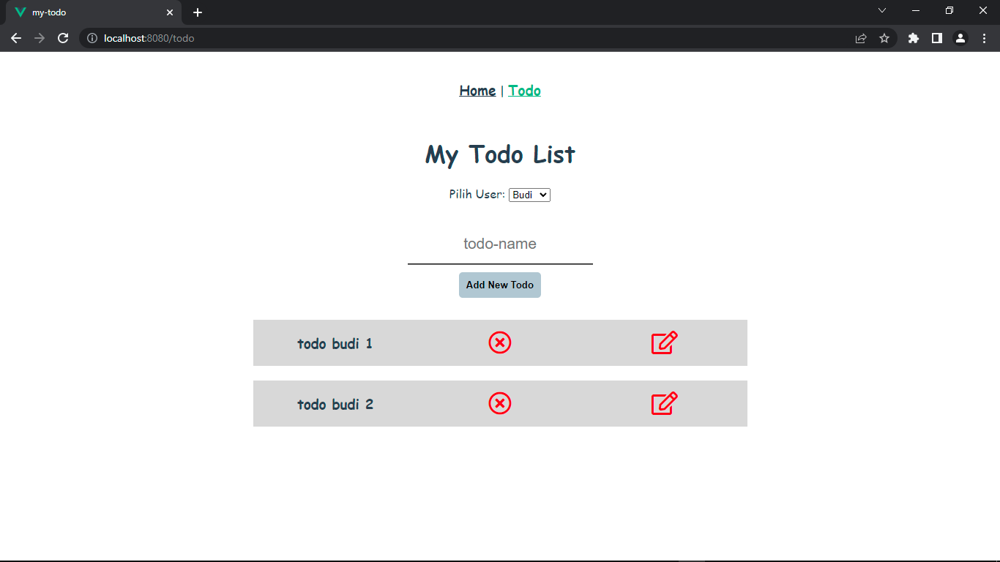
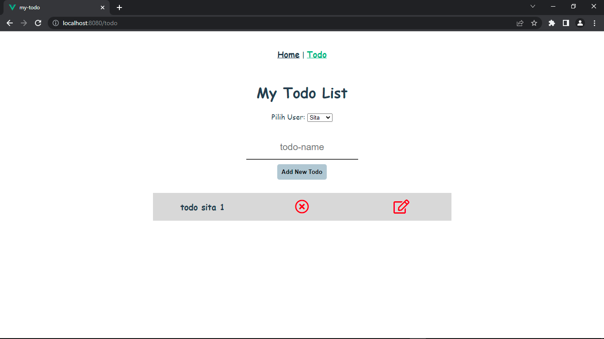

# 23 Understanding GraphQL Query

## Resume

Secara garis besar berikut adalah sub topik yang saya pelajari dari materi ini:

### GraphQL Overview

GraphQL adalah bahasa kueri untuk API dan runtime sisi server untuk mengeksekusi kueri dengan menggunakan sistem tipe yang Anda tentukan untuk data Anda. GraphQL meminimalkan jumlah data yang perlu ditransfer melalui jaringan. Dengan graphQL kita dapat menggunakan satu endpoint (/graphQL) untuk setiap permintaan yang diperlukan.

Contoh perbandingan REST dan GraphQL:

- REST
  /books /users
  /movies

- GraphQL
  /graphql

Sebelum kita dapat melakukan GraphQL maka kita perlu mengatur GraphQL Server (Backend), Anda dapat menggunakan Hasura, Apollo Server atau lainnya untuk melakukan itu. Kemudian kita dapat menggunakan GraphQL pada klien baik menggunakan Prisma, Apollo Client, Postman, dll.

Ada 3 fitur utama dalam klien GraphQL:

1. Query, mendapatkan data berdasarkan kueri tertentu yang telah ditentukan
2. Mutation, insert, update, delete data
3. Mutation, mendapatkan data secara realtime / berdasarkan suatu event

Dengan graphQL kita bisa mendapatkan data persis seperti apa yang kita butuhkan. Dengan menentukan data apa yang ingin didapatkan, graphQL akan memberi respon data berdasarkan apa yang kita definisikan. Misalnya, jika ada satu koleksi dalam database yang menyimpan data film. Semua data yang tidak perlu seperti director, created_at dan updated_at tidak akan disertakan.

REST

```
[{
  id: 1,
  title: "Batman",
  year: "2020",
  director: {
    id: 3,
  },
  created_at: "2020-12-22T03:16:09.000Z",
  updated_at: "2020-12-23T14:22:20.000Z"",
}]
```

GraphQL Query

```
{
  query {
    movies {
      id
      title
    }
  }
}
```

GraphQL Result

```
{
  movies: [{
    id: 1,
    title: "Batman",
  }]
}
```

Kita juga dapat menggunakan kueri untuk mendapatkan data dari beberapa koleksi terkait. Sebagai contoh, jika kita ingin mendapatkan data director, kita perlu menggunakan director.id untuk mendapatkan data dari titik akhir lain, tetapi dengan graphql kita juga dapat menentukan bidang yang diperlukan secara langsung selama tersedia di server GraphQL.

Kita juga dapat menggunakan kueri untuk mendapatkan data dari beberapa koleksi yang tidak terkait untuk meminimalkan permintaan jaringan. Gambar jika kita ingin data film dan data buku. Dengan REST kita perlu melakukan setidaknya 2 permintaan ke 2 titik akhir yang berbeda. Dengan GraphQL kita dapat melakukan 1 permintaan untuk mendapatkan data tersebut.

GraphQL Query

```
{
  query {
    movies {
      id
      title
    }
    books {
      id
      title
    }
  }
}
```

GraphQL Result

```
{
  movies: [{
    id: 1,
    title: "Batman",
  }]
  books: [{
    id: 1,
    title: "Doraemon",
  }]
}
```

Fragmen GraphQL adalah bagian dari logika yang dapat dibagi antara beberapa kueri dan mutasi. Kita dapat menggunakan fragmen untuk menyederhanakan kueri atau mutasi.

GraphQL Query

```
fragment FR_Movie on movie {
  title
  year
}

{
  query {
    movies {
      ...FR_Movie
      director {
        name
        age
      }
    }
  }
}
```

GraphQL Result

```
{
  movies: [{
    id: 1,
    title: "Batman",
    director: {
      name: "Nolan",
      age: 51,
    }
  }]
}
```

MuMutasi pada dasarnya adalah fungsi untuk memperbarui, menyisipkan, dan menghapus data. Kita perlu menentukan operasi apa yang ingin kita lakukan (berdasarkan operasi yang tersedia pada server graphql Anda) dan kemudian menentukan data apa yang perlu dikembalikan GraphQL.

```
mutation {
  insert_film(
    objects: {
      title: "Something",
      description:"New Movies" }) {
    returning {
    id
    }
  }
}
```

Subscriptions adalah fitur GraphQL yang memungkinkan server mengirim data ke kliennya ketika peristiwa tertentu terjadi. Langganan biasanya diimplementasikan dengan WebSockets. Dalam pengaturan itu, server mempertahankan koneksi yang stabil ke klien berlangganannya.

Ketika data dimodifikasi maka klien akan mendapatkan data yang diperbarui secara langsung secara real-time. Dalam contoh di bawah ini, jika kita melakukan langganan pada pengumpulan orang maka setiap kali orang baru ditambahkan atau ketika data dihapus atau dimodifikasi maka kita akan mendapatkan data yang diperbarui secara real-time langsung ke klien kita. Langganan hanya akan terjadi di sisi klien bukan sisi server.

```
subscription {
  person {
    id
    name
  }
}
```

### Hasura & Heroku

Hasura adalah layanan yang menyediakan graphql dan rest api. Dikelola penuh di hasura cloud atau self-hosted. Buka https://hasura.io/ dan buat server graphql Anda sendiri yang baru

Heroku adalah platform cloud sebagai layanan yang mendukung beberapa bahasa pemrograman. Heroku juga menyediakan database postgres gratis. Buka https://heroku.com/ dan buat layanan Anda sendiri

### Apollo Setup

Apollo Client adalah pustaka manajemen negara yang komprehensif untuk JavaScript yang memungkinkan kami mengelola data lokal dan jarak jauh dengan GraphQL. Gunakan untuk mengambil, menyimpan cache, dan memodifikasi data aplikasi, sambil memperbarui Ul secara otomatis. Pustaka @apollo/klien inti menyediakan integrasi bawaan dengan React. Kami menggunakan klien Apollo untuk melakukan operasi GraphQL (kueri, mutasi, dan langganan) di dalam aplikasi React atau NEXT JS kami. Klien Apollo bekerja dengan baik dengan server GraphQL apa pun (Hasura, Apollo Server, dll)

Instalasi

1. Buat proyek Vue baru
   npm install --save vue-apollo graphql apollo-boost
2. Jangan lupa untuk melakukan commit untuk melacak progress

Library Setup

1. Siapkan pada file utama.js
2. Buat apolloClient

```
Vue.config.productionTip = false;

const httpLink = new HttpLink({
  uri: ''
});

const apolloClient = new ApolloClient({
  link: httpLink,
  cache: new InMemoryCache(),
  connectToDevTools: true
});

Vue.use(VueApollo);

const apolloProvider = new VueApollo ({
  defaultClient: apolloClient
});
```

- uri menentukan URL server GraphQL kita
- cache adalah instance dari InMemoryCache, yang digunakan Apollo Client untuk menyimpan hasil kueri setelah mengambilnya

3. Setting apollo provider, pada main.js import ApolloProvider
   ApolloProvider membungkus aplikasi React Anda dan menempatkan Klien Apollo pada konteksnya, yang memungkinkan Anda mengaksesnya dari mana saja di pohon komponen Anda

```
new Vue ({
  el: '#app',
  apolloProvider,
  render: h => h(App)
});
```

### Query

Anda dapat menggunakan komponen ApolloQuery (atau apollo-query) untuk membut kueri Apollo secara langsung di template Anda.

### Mutation

Anda dapat menggunakan komponen ApolloMutation (atau apollo-mutation) untuk memanggil mutasi Apollo langsung di template Anda.

### Subscription

Setting Subscription

1. Untuk mengaktifkan langganan berbasis websocket, diperlukan sedikit pengaturan tambahan:
   npm install --save apollo-link-ws apollo-utilities
2. Impor semua modul yang diperlukan dan pisahkan antara tautan http dan websocket

Setting Subscription - ApolloSubscribe To More

Anda dapat berlangganan lebih banyak data dengan komponen ApolloSubscribeToMore (atau apollo-subscribe-to-more). Anda dapat menempatkan sebanyak mungkin dari mereka yang Anda inginkan di dalam komponen `<ApolloQuery>`.

## Task

1. Hubungkan project react yang ada di atas dengan GraphQL
2. Lakukan query pada database kalian. Sehingga, ketika aplikasi pertama kali dibuka, aplikasi kalian langsung melakukan fetch data dan menampilkannya pada layar.
3. Buatlah fitur melakukan query berdasarkan inputan dari user. sehingga, dapat menampilkan data sesuai dengan input berdasarkan id.

Berikut kode hasil dari praktikum ini:

- [vue.config.js](./praktikum/vue.config.js)
- src
  - [main.js](./praktikum/src/main.js)
  - [App.vue](./praktikum/src/App.vue)
  - components
    - [HelloWorld.vue](./praktikum/src/components/HelloWorld.vue)
    - [TodoListItem.vue](./praktikum/src/components/TodoListItem.vue)
  - graphql
    - [addTodo.gql](./praktikum/src/graphql/addTodo.gql)
    - [deleteTodo.gql](./praktikum/src/graphql/deleteTodo.gql)
    - [getTodo.gql](./praktikum/src/graphql/getTodo.gql)
    - [getUser.gql](./praktikum/src/graphql/getUser.gql)
    - [subscriptionTodo.gql](./praktikum/src/graphql/subscriptionTodo.gql)
    - [updateTodo.gql](./praktikum/src/graphql/updateTodo.gql)
  - router
    - [index.js](./praktikum/src/router/index.js)
  - views
    - [HomeView.vue](./praktikum/src/views/HomeView.vue)
    - [TodoView.vue](./praktikum/src/views/TodoView.vue)

Output:

- User Derry

  

- User Budi

  

- User Sita

  
