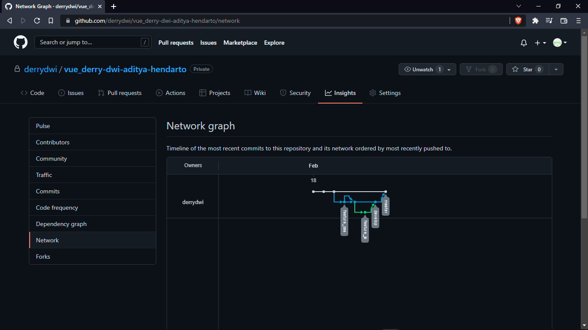

# 2 Version Control and Branch Management (Git)

## Resume

Berikut adalah 3 poin yang saya pelajari dari materi ini:
1. Git
2. Commit
3. Working Directory, Staging Area, dan Repository

### Git

Git merupakan Version Control System yang populer digunakan dikalangan para developer untuk saling berkolaborasi dalam pengembangan software guna melacak perubahan di setiap source code serta melacak riwayat status oleh siapa dan kapan file tersebut diubah.

### Commit

Commit dalam Git mampu merekam catatan di setiap perubahan yang dilakukan oleh masing-masing contributor yang terlibat.

### Working Directory, Staging Area, dan Repository

Staging Area dalam Git memiliki 3 fase diantaranya yakni working directory, staging area, dan repository. Working directory adalah tahap dimana source code baru tersimpan di lokal dan belum direkam catatan perubahannya. Staging area adalah tahap dimana source code baru tersimpan di lokal dan sudah diinisialisasi supaya kemudian dapat dilakukan commit. Sedangkan repository adalah tempat tahap akhir dimana telah dilakukan commit dan push, sehingga source code sudah dapat diakses secara remote.

## Task

### 1. Branch Management

Pada task ini membuat branch develop, feature_css, dan feature_js. Dimana masing-masing branch feature berfungsi sebagai tempat mengembangkan fitur baru, untuk kemudian dilakukan merge ke branch develop. Di akhir ketika program sudah siap release branch develop dapat di merge ke master supaya head secara default mengarah ke branch master.

Berikut kode hasil dari praktikum ini.

[index.html](./praktikum/index.html)

Output:

Link lebih detail:

- Link repo branch master: https://github.com/derrydwi/vue_derry-dwi-aditya-hendarto/tree/master/2_Version%20Control%20and%20Branch%20Management%20(Git)/praktikum
- Link repo branch develop: https://github.com/derrydwi/vue_derry-dwi-aditya-hendarto/tree/develop/2_Version%20Control%20and%20Branch%20Management%20(Git)/praktikum
- Link repo branch feature_css: https://github.com/derrydwi/vue_derry-dwi-aditya-hendarto/tree/feature_css/2_Version%20Control%20and%20Branch%20Management%20(Git)/praktikum
- Link repo branch feature_js: https://github.com/derrydwi/vue_derry-dwi-aditya-hendarto/tree/feature_js/2_Version%20Control%20and%20Branch%20Management%20(Git)/praktikum
- Link insight network (Timeline 18 Februari 2022): https://github.com/derrydwi/vue_derry-dwi-aditya-hendarto/network
