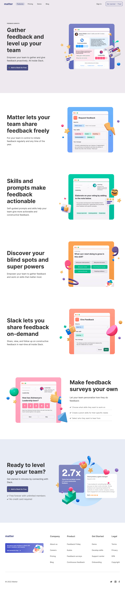
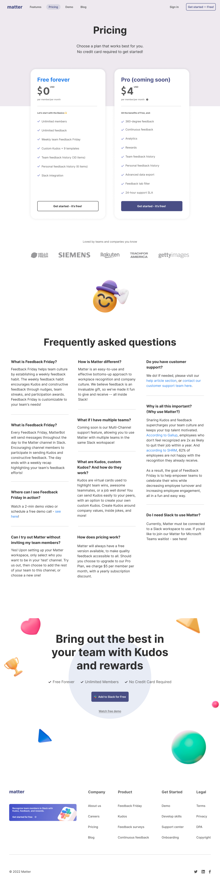
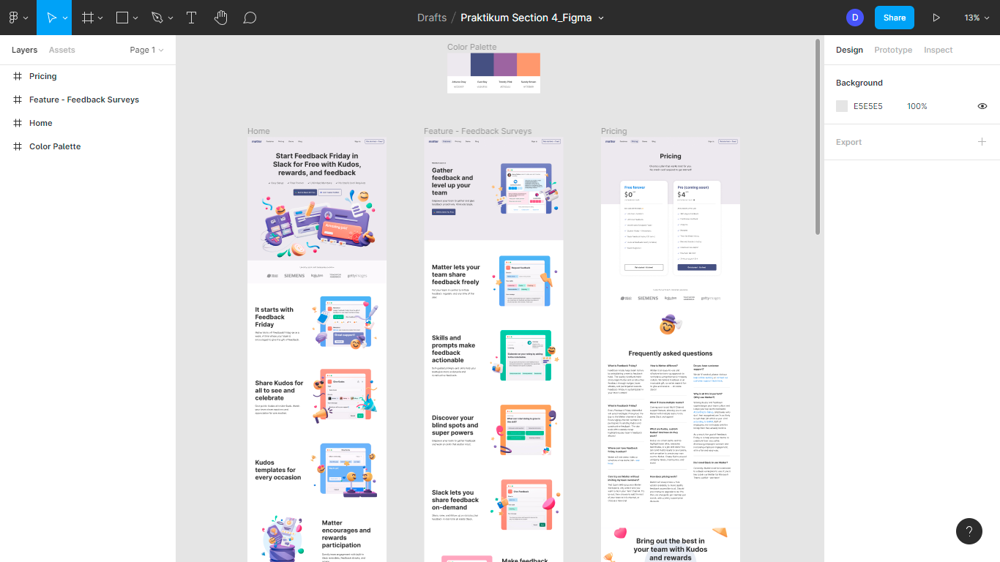

# 4 Figma

## Resume

### Pengertian

Figma adalah editor grafis vektor dan alat prototyping yang terutama berbasis web, dengan fitur offline tambahan yang diaktifkan oleh aplikasi desktop untuk macOS dan Windows.

### Kelebihan

- Gratis
- Tersedia di MacOS dan Windows
- Kolaborasi real-time
- Dukungan import Sketch file; dll.
- Anda dapat mengimpor file Sketch (tetapi hati-hati, Anda tidak dapat mengekspor ke Sketch!)
- Integrated Developers hand-off/Specs untuk Mac dan PC
- Prototyping berkualitas tinggi terintegrasi

### Kekurangan

- Perlu terhubung ke internet untuk pengalaman penggunaan yang baik.

### Tools yang tersedia

- Import sketch file
- Create frame
- Grid and layout
- Layers and groups
- Images
- Typography; dll.

## Task

### 1. Buat sebuah desain UI/UX dari desain yang telah dipilih sebelumnya menggunakan tools Figma, lalu buatlah prototype dari desain tersebut.

Pada task ini saya membuat desain UI/UX dari MatterApp yang bersumber dari:
- https://www.behance.net/gallery/129953339/Matterappcom
- https://matterapp.com

Berikut desain dari hasil praktikum ini.

- https://www.figma.com/file/ZIeHOA86xYHvubSB6manii/Praktikum-Section-4_Figma?node-id=0%3A1

Output berupa screenshot desain yang dibuat:

- Home Page

- Feature Feedback Surveys Page

- Pricing Page

- Figma

