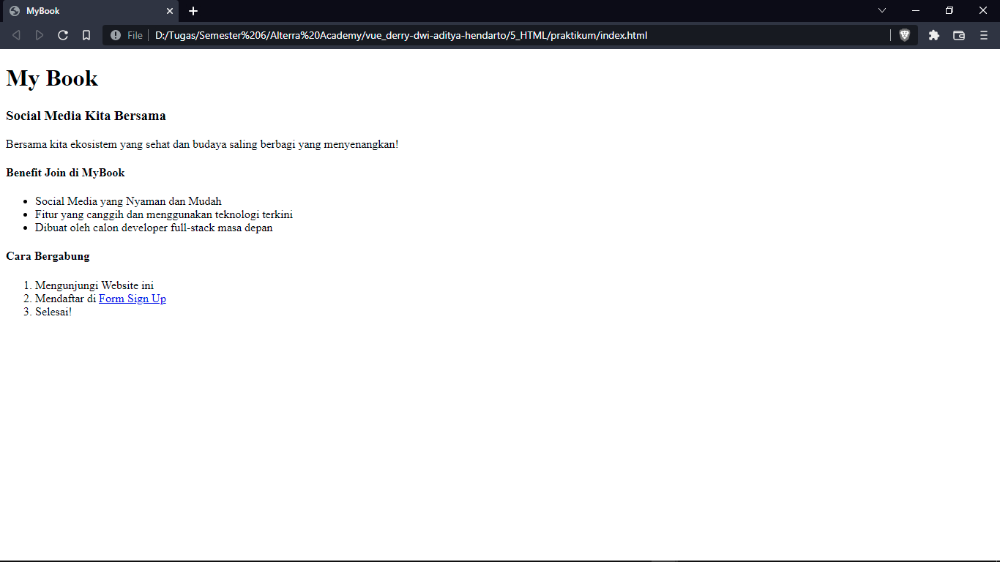
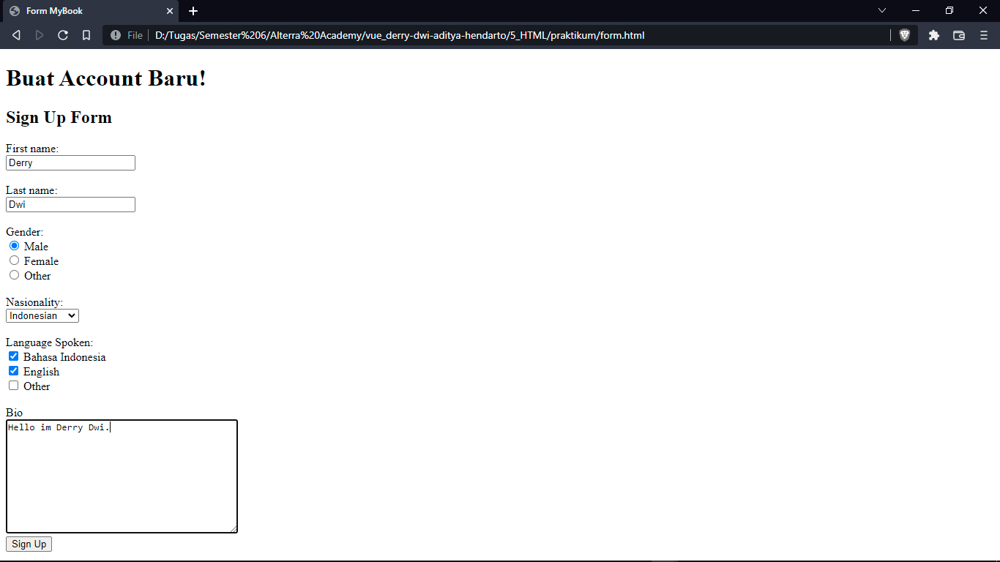
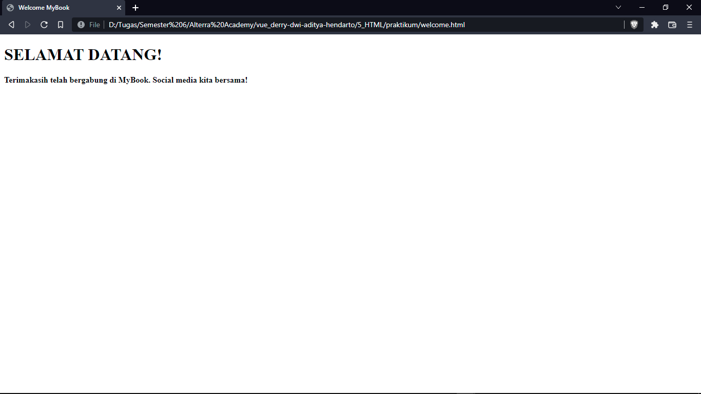

# 5 HTML

## Resume

Berikut adalah 3 poin yang saya pelajari dari materi ini:
1. Pendahuluan
2. Kegunaan HTML
3. Tag HTML

### Pendahuluan

- Frontend merupakan suatu tampilan pada website yang dilihat secara langsung oleh user, yang umumnya dirancang menggunakan file HTML, CSS, dan Javascript.
- Hypertext Markup Language (HTML) yakni suatu standar yang digunakan secara global untuk menampilkan halaman web.
- HTML dapat dianalogikan sebagai kerangka dari halaman website.

### Kegunaan HTML

- Membuat struktur website
- Mengatur tampilan website
- Membuat tabel, form, gambar, dsb.
- Mempublikasikan halaman web secara online; dll.

### Tag HTML

- `<! DOCTYPE html>`
  Mendefinisikan file sebagai HTML 5
- `<html>`
  Elemen root dari halaman HTML
- `<head>`
  Informasi meta
- `<title>`
  Judul file HTML
- `<body>`
  Konten halaman

## Task

Membuat 3 halaman html yang masing-masing diberi nama index.html, form.html, dan welcome.html

Dengan ketentuan:
- Pada halaman index text Form Sign Up, buatlah menjadi sebuah link text sehingga ketika di klik akan mengarah user ke halaman form.html
- Pada halaman form ketika dilakukan submit maka akan mengarahkan user ke halaman welcome.html
- Pada halaman welcome buat desain seperti yang telah ditentukan

Berikut source code dari hasil pratikum ini:
- [index.html](./praktikum/index.html)
- [form.html](./praktikum/form.html)
- [welcome.html](./praktikum/welcome.html)

Output berupa screenshot:
- Index Page

- Form Page

- Welcome Page

