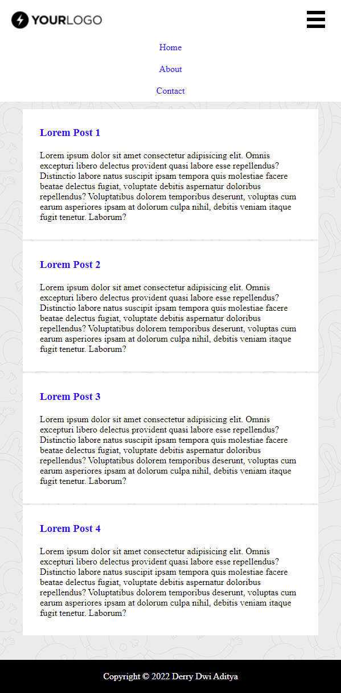

# 6 CSS

## Resume

Berikut diantaranya adalah beberapa poin yang saya pelajari dari materi ini:
1. Pendahuluan
2. Metode penambahan file CSS
3. Syntax CSS
4. CSS Font Properties

### Pendahuluan

Cascading Style Sheets (CSS) digunakan untuk mendesain halaman depan atau tampilan website. CSS mampu mengatur property seperti color, font, background, width, height, display, position, dll.

### Metode penambahan file CSS

Terdapat 3 cara dalam menambahkan file CSS ke dalam HTML, yaitu:

- External CSS, file CSS dipanggil pada tag `<head>` di file HTML.
- Internal CSS, syntax CSS disisipkan pada file HTML pada tag `<style>`.
- Inline CSS, disisipkan pada tag elemen di HTML.

### Syntax CSS

Syntax CSS terdiri dari 2 bagian yakni:

1. Selector
2. Declaration

Selector CSS dibagi menjadi 2 jenis yaitu menggunakan ID (#) dan Class (.)

### CSS Font Properties

CSS Font dapat digunakan untuk melakukan styling font. Beberapa propertiesnya yakni sebagai berikut:
1. font, untuk menentukan semua properti font dalam satu deklarasi
2. font-family, untuk menentukan jenis font
3. font-size, untuk menentukan ukuran font
4. font-weight, untuk menentukan ketebalan untuk font
5. font-style, untuk menentukan gaya font

## Task

### 1. Membuat Box

Ketentuan: Membuat 3 buah box. Box berwarna merah dan biru berukuran 100px dan terletak di baris pertama, serta box berwarna hijau berukuran 350px dengan border radius terletak di baris kedua.

Berikut kode hasil dari praktikum ini.

[file1.html](./praktikum/soal_1/file1.html)

Output:

### 2. Membuat Halaman Post Responsive

Ketentuan: Terdapat header, post card, dan footer.

Berikut kode hasil dari praktikum ini.

- [index.html](./praktikum/soal_2/index.html)
- [style.css](./praktikum/soal_2/assets/css/style.css)
- [index.js](./praktikum/soal_2/assets/js/index.js)

Output:
- Tablet, desktop, large desktop (>= 600px)

- Smartphone (< 600px)

Close | Open
--- | ---
 | 
