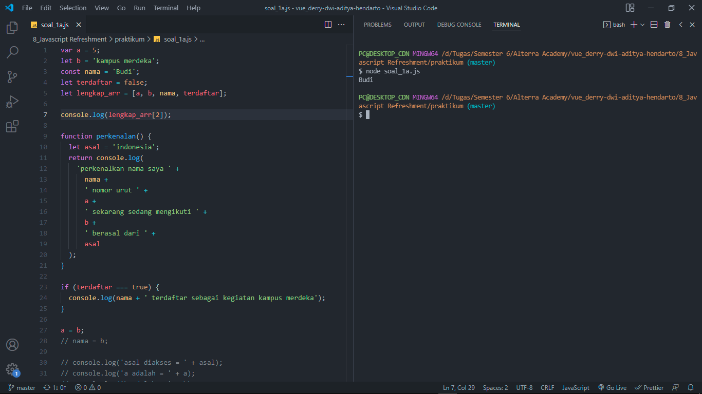
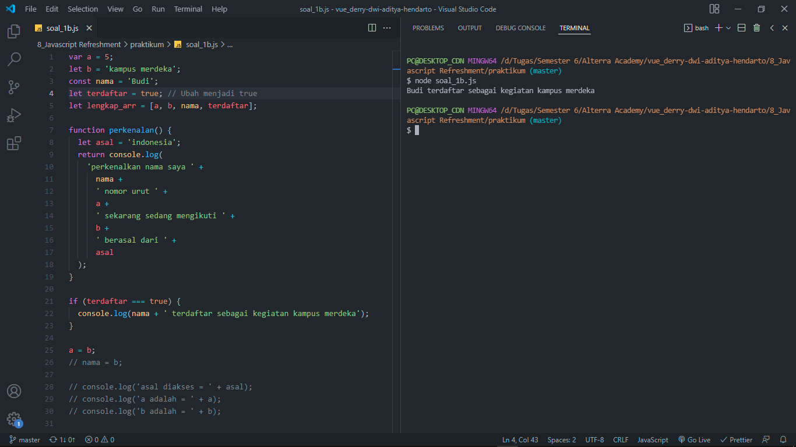
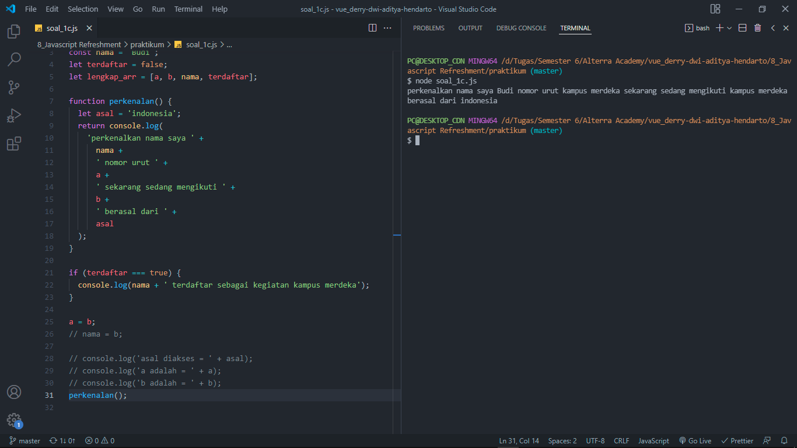
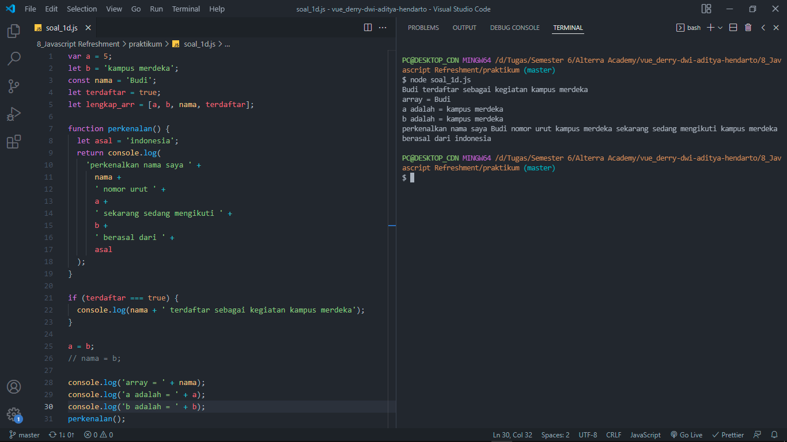
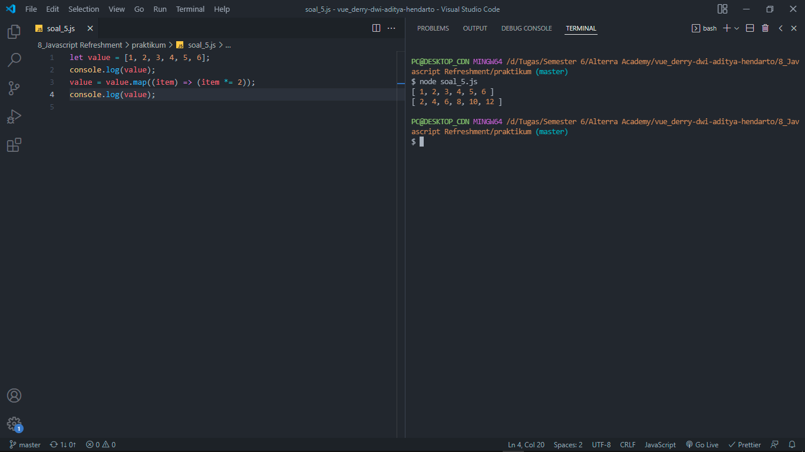
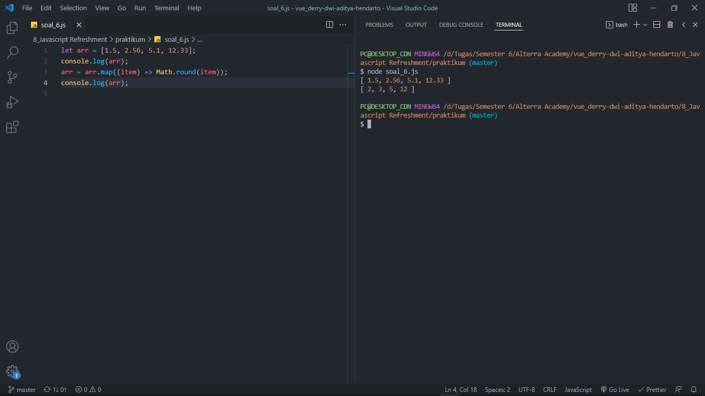

# 8 Javascript Refreshment

## Resume

Berikut adalah beberapa poin yang saya pelajari dari materi ini:
1. Pendahuluan Javascript
2. Karakteristik var, let, dan const
3. Declaration, scoping, dan hoisting
4. Jenis tipe data
5. Destructuring

### Pendahuluan Javascript

Javascript adalah suatu bahasa pemrograman yang bersifat high-level, scripting, untyped dan interpreted.

### Karakteristik var, let, dan const

Var memperbolehkan redeclaration, sedangkan pada let dan const tidak diperbolehkan. Var dan let memperbolehkan reassignment, sedangkan pada const tidak diperbolehkan.

### Declaration, scoping, dan hoisting

Declaration adalah suatu proses pembuatan variabel baru. Scoping adalah ruang lingkup variabel, fungsi, atau suatu objek dapat diakses. Hoisting adalah kondisi dimana variabel atau fungsi dapat diakses sebelum dideklarasikan.

### Jenis tipe data

- Primitives, unit pemrosesan terkecil dan elemen paling sederhana dalam bahasa pemrograman. Primitif bersifat dapat meneruskan suatu nilai. Contoh: String, boolean, number, bigint, dll.
- Objects, unit yang menampung properti dan fungsi atau method. Objects disebut juga sebagai collection atau reference type. Contoh: Object, array, function, date, set, map, dll.

### Destructuring

Destructuring merupakan suatu ekspersi pada javascript yang berfungsi untuk menyalin nilai dari array atau properti dari object ke dalam suatu variabel baru.

## Task

### 1A. Ambillah index ke 2 dalam array di baris 5 dan tampilkan dalam console

Berikut kode hasil dari praktikum ini:

[soal_1a.js](./praktikum/soal_1a.js)

Output:

### 1B. Ubah kode diatas sehingga dapat menampilkan baris 22 di dalam console

Berikut kode hasil dari praktikum ini:

[soal_1b.js](./praktikum/soal_1b.js)

Output:

### 1C. Lakukan pemanggilan untuk function perkenalan pada baris 31

Berikut kode hasil dari praktikum ini:

[soal_1c.js](./praktikum/soal_1c.js)

Output:

### 1D. Kalian bebas mengubah kode di atas sehingga menampilkan output pada console seperti pada gambar di bawah

Berikut kode hasil dari praktikum ini:

[soal_1d.js](./praktikum/soal_1d.js)

Output:

### 2A. jelaskan kenapa baris 21,22,23 tidak dapat tampil?

Jawab:
Baris 21,22,23 tidak dapat tampil karena terdapat suatu kondisi yang tidak terpenuhi pada percabangan di baris 21. Dimana percabangan yang ada melakukan pengecekan terhadap variabel terdaftar, apakah bernilai true atau tidak. Namun karena sebelumnya variabel terdaftar yang ada pada baris 4 diinisialisasikan dengan nilai false, artinya kondisi pada percabangan tidak terpenuhi. Sehingga statemtent pada baris 22 tidak dijalankan.

### 2B. jelaskan kenapa deklarasi pada baris 26 menyebabkan error?

Jawab:
Deklarasi pada baris 26 menyebabkan error Assignment to constant variable karena memang reassign value tidak dapat dilakukan pada variabel yang dideklarasikan menggunakan const. Mengingat sifat dari const sendiri tidak dapat diubah dan diperuntukkan untuk menampung nilai statis.

### 2C. Dengan melakukan komen pada baris ke 26, apakah baris 28 dapat di eksekusi? jelaskan.

Jawab:
Dengan melakukan komen pada baris ke 26, baris 28 tetap belum dapat dieksekusi. Alasannya karena error yang dihasilkan memang bukan merujuk pada error Assignment to constant variable tadi, melainkan error dengan pesan asal is not defined. Penyebabnya adalah variabel asal yang diinisialisasikan di dalam function perkenalan baris 8 tersebut berada dalam scope function atau local. Sehingga variabel tersebut hanya dapat dikenali dan dipanggil di scope function tersebut saja. Oleh karena itu ketika dipanggil di luar scope function tidak dapat dikenali.

### 3. Lakukan desctucturing pada kode di bawah sehingga Budi Tersimpan dalam variable bernama a, Sita tersimpan dalam variabel bernama b, dan Ayutersimpan dalam variable bernama c.

Berikut kode hasil dari praktikum ini:

[soal_3.js](./praktikum/soal_3.js)

Output:

### 5. Kalian memiliki sebuah variabel berikut (let bdays = ['10-17','05-19','20-19']). Ubahlah tanda (-) dalam variabel tersebut menjadi (/) sehingga output yang akan keluar dalam console menjadi [ '10/17', '05/19', '20/19' ]

Berikut kode hasil dari praktikum ini:

[soal_5.js](./praktikum/soal_5.js)

Output:

### 6. Kalian memiliki variabel berikut (let value = [1,2,3,4,5,6]). Kalikan setiap value dalam array tersebut dengan dua. Sehingga, ketika dipanggil variable value mengeluarkan output berupa [ 2, 4, 6, 8, 10, 12 ]

Berikut kode hasil dari praktikum ini:

[soal_6.js](./praktikum/soal_6.js)

Output:

### 7. Kalian memiliki variabel berikut (let arr = [1.5, 2.56,5.1, 12.33]) Bulatkan ke atas variable tersebut sehingga output yang dihasilkan adalah [ 2, 3, 6, 13 ]

Berikut kode hasil dari praktikum ini:

[soal_7.js](./praktikum/soal_7.js)

Output:

